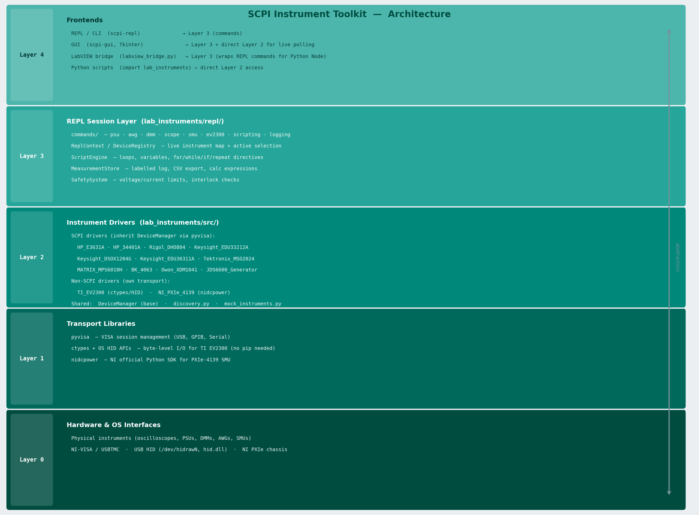

# Architecture — Layers of Abstraction

This page shows how the toolkit is layered, from hardware at the center out to the various user-facing frontends.

---



---

## The Onion

```
╔══════════════════════════════════════════════════════════════════════════════╗
║                         FRONTENDS  (Layer 4)                                ║
║                                                                              ║
║   ┌──────────────┐  ┌──────────────┐  ┌──────────────┐  ┌──────────────┐   ║
║   │  REPL / CLI  │  │  GUI (Tk)    │  │  LabVIEW     │  │  Your Script │   ║
║   │ scpi-repl    │  │  scpi-gui    │  │  Python Node │  │  import ...  │   ║
║   │ shell.py     │  │  app.py      │  │  (bridge)    │  │  (examples)  │   ║
║   └──────┬───────┘  └──────┬───────┘  └──────┬───────┘  └──────┬───────┘   ║
║          │                 │                  │                  │           ║
╠══════════╪═════════════════╪══════════════════╪══════════════════╪═══════════╣
║          │    REPL LAYER   │   (Layer 3)       │                  │           ║
║   ┌──────▼─────────────────▼──────────────┐   │                  │           ║
║   │            commands/                  │   │                  │           ║
║   │  general · psu · awg · dmm · scope   │   │                  │           ║
║   │  smu · ev2300 · scripting · logging  │   │                  │           ║
║   │                                       │   │                  │           ║
║   │  ReplContext / DeviceRegistry         │   │                  │           ║
║   │  ScriptEngine · MeasurementStore      │   │                  │           ║
║   └──────────────────┬────────────────────┘   │                  │           ║
║                      │                        │                  │           ║
╠══════════════════════╪════════════════════════╪══════════════════╪═══════════╣
║                      │  DRIVER LAYER          │   (Layer 2)      │           ║
║   ┌──────────────────▼────────────────────────▼──────────────────▼───────┐  ║
║   │                      lab_instruments/src/                            │  ║
║   │                                                                      │  ║
║   │  ┌─────────────────────────┐   ┌─────────────────┐                  │  ║
║   │  │  SCPI / PyVISA drivers  │   │  Non-SCPI        │                  │  ║
║   │  │  (inherit DeviceManager)│   │  drivers         │                  │  ║
║   │  │                         │   │                  │                  │  ║
║   │  │  HP_E3631A   (PSU)      │   │  TI_EV2300       │                  │  ║
║   │  │  HP_34401A   (DMM)      │   │  (HID/hidraw)    │                  │  ║
║   │  │  Keysight_EDU33212A(AWG)│   │                  │                  │  ║
║   │  │  Keysight_EDU34450A(DMM)│   │  NI_PXIe_4139    │                  │  ║
║   │  │  Keysight_DSOX1204G(Osc)│   │  (nidcpower)     │                  │  ║
║   │  │  Keysight_EDU36311A(PSU)│   │                  │                  │  ║
║   │  │  Rigol_DHO804    (Osc)  │   └─────────────────┘                  │  ║
║   │  │  Tektronix_MSO2024(Osc) │                                         │  ║
║   │  │  MATRIX_MPS6010H (PSU)  │   DeviceManager (base)                  │  ║
║   │  │  BK_4063         (AWG)  │   discovery.py (find_all / auto-name)   │  ║
║   │  │  Owon_XDM1041    (DMM)  │   mock_instruments.py                   │  ║
║   │  │  JDS6600_Generator(AWG) │                                         │  ║
║   │  └─────────────────────────┘                                         │  ║
║   └──────────────────────────────────────────────────────────────────────┘  ║
║                                                                              ║
╠══════════════════════════════════════════════════════════════════════════════╣
║                      TRANSPORT LAYER  (Layer 1)                              ║
║                                                                              ║
║   ┌─────────────────┐  ┌───────────────────┐  ┌───────────────────────┐    ║
║   │   PyVISA        │  │  ctypes / hidraw  │  │  nidcpower            │    ║
║   │  (VISA backend) │  │  (HID protocol)   │  │  (NI-DCPower SDK)     │    ║
║   └────────┬────────┘  └────────┬──────────┘  └──────────┬────────────┘    ║
║            │                    │                          │                 ║
╠════════════╪════════════════════╪══════════════════════════╪═════════════════╣
║            │  PHYSICAL LAYER    │   (Layer 0)               │                ║
║   ┌────────▼───────┐   ┌────────▼──────┐   ┌──────────────▼─────────────┐  ║
║   │ NI-VISA / USBTMC│  │  USB HID      │  │  NI-DCPower runtime        │  ║
║   │ GPIB / Serial   │  │  /dev/hidrawN │  │  PXIe chassis + card       │  ║
║   └────────┬────────┘  └────────┬──────┘  └────────────────────────────┘  ║
║            │                    │                                            ║
║   ┌────────▼────────────────────▼────────────────────────────────────────┐  ║
║   │                       INSTRUMENTS (hardware)                         │  ║
║   │  oscilloscopes · power supplies · multimeters · function generators  │  ║
║   │  SMU · USB-to-I2C adapters                                          │  ║
║   └──────────────────────────────────────────────────────────────────────┘  ║
╚══════════════════════════════════════════════════════════════════════════════╝
```

---

## Layer-by-layer breakdown

### Layer 0 — Hardware & OS interfaces

The physical instruments and the OS-level drivers that expose them:

| Interface | Used by | Notes |
|-----------|---------|-------|
| NI-VISA / USBTMC | SCPI instruments | USB, GPIB, Serial |
| `/dev/hidrawN` (Linux) / `hid.dll` (Windows) | TI EV2300 | Raw HID, no VISA needed |
| NI-DCPower runtime | NI PXIe-4139 | PXIe chassis, proprietary SDK |

---

### Layer 1 — Transport libraries

Python packages that talk to the OS interfaces:

| Library | Role |
|---------|------|
| `pyvisa` | Unified VISA session management — open, write, query, close |
| `ctypes` + OS HID APIs | Low-level byte I/O for the EV2300 (no pip install needed) |
| `nidcpower` | NI's official Python SDK for the PXIe-4139 SMU |

---

### Layer 2 — Driver layer (`lab_instruments/src/`)

One class per instrument model. Two families:

**SCPI drivers** inherit `DeviceManager` (which wraps a `pyvisa.Resource`) and speak the SCPI command set. Every public method is a named operation: `set_voltage`, `measure_current`, `enable_output`, etc.

**Non-SCPI drivers** own their own transport:

- `TI_EV2300` — HID protocol over `ctypes`/hidraw, no `DeviceManager`
- `NI_PXIe_4139` — `nidcpower` session, no `DeviceManager`

`DeviceManager` (base class) handles connect/disconnect/query/write.  
`discovery.py` probes all VISA addresses, identifies models by `*IDN?`, and returns named instances (`psu1`, `dmm1`, …).  
`mock_instruments.py` provides in-process fakes for testing without hardware.

---

### Layer 3 — REPL layer (`lab_instruments/repl/`)

Sits on top of the driver layer and adds interactive-session state:

| Component | Role |
|-----------|------|
| `ReplContext` / `DeviceRegistry` | Holds the live instrument map (`psu1 → HP_E3631A instance`) and active selection |
| `commands/` | One file per instrument family — parses text args and calls driver methods |
| `ScriptEngine` | Loops, variables, `for`/`while`, `repeat`, `if` directives |
| `MeasurementStore` | Labelled measurement log, CSV export, `calc` expressions |
| `SafetySystem` | Voltage/current limits, interlock checks before writes |

---

### Layer 4 — Frontends

All four frontends consume the driver layer (Layer 2) directly or via the REPL layer (Layer 3):

| Frontend | Entry point | Uses |
|----------|-------------|------|
| **REPL / CLI** (`scpi-repl`) | `shell.py` → `cmd.Cmd` loop | Layer 3 (commands) |
| **GUI** (`scpi-gui`) | `gui/app.py` → Tkinter | Layer 3 (commands) + driver layer directly for live widgets |
| **LabVIEW bridge** | `labview_bridge.py` | Layer 3 — flat module-level functions that invoke REPL commands, LabVIEW-compatible types |
| **Python scripts** | `from lab_instruments.src import ...` | Layer 2 directly |

---

## What bypasses what

- The **GUI** talks to instrument blocks (Layer 3) for command dispatch but reads driver objects directly for live polling (voltage readback, waveform capture).
- The **LabVIEW bridge** goes through Layer 3 — it exposes flat module-level functions that LabVIEW's Python Node can call with primitive types, and those functions invoke the same REPL command handlers. This means instrument logic, safety checks, and scripting stay in one place.
- The **EV2300 and NI PXIe-4139** are optional imports everywhere — missing hardware or missing SDK produces a clean `ImportError` fallback, not a crash.
- **Mocks** live at Layer 2 and replace real driver instances, so Layers 3 and 4 are fully testable without hardware.
