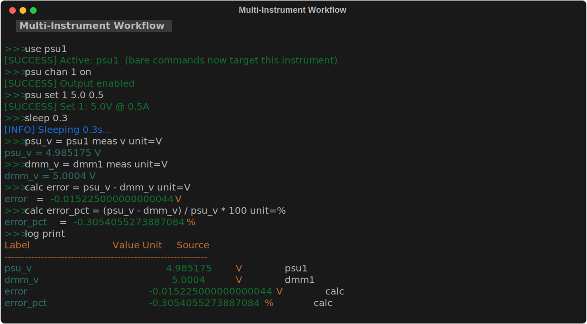

# Example Workflows

These bundled examples demonstrate common lab measurement workflows. Load any example into your session and run it, or use it as a starting point for your own scripts.



```text
examples                        # list all bundled examples
examples load <name>            # load a specific example
examples load all               # load all examples at once
script run <name> [params]      # run a loaded example
```

---

## psu_dmm_test

**Set PSU to a voltage, measure with DMM, log result.**

This is the simplest useful workflow: power a DUT at a target voltage and record what the DMM actually measures.

**Parameters:**

| Parameter | Default | Description |
|-----------|---------|-------------|
| `voltage` | `5.0` | Target PSU voltage in volts. |
| `label` | `vtest` | Label for the DMM measurement in the log. |

**Load and run:**

```text
examples load psu_dmm_test
script run psu_dmm_test voltage=5.0 label=vtest
script run psu_dmm_test voltage=3.3 label=v3v3
```

**What it does:**

1. Turns on PSU channel 1
2. Sets the voltage to `{voltage}` V
3. Waits 500 ms for the output to settle
4. Records the PSU's measured output as `psu_v`
5. Takes a DC voltage reading from the DMM, records as `{label}`
6. Prints the log

**Script source:**

```text
# psu_dmm_test
voltage = 5.0
label = vtest

print "=== PSU/DMM Voltage Test ==="
print "Target: {voltage}V"

psu1 chan 1 on
psu1 set 1 {voltage}
sleep 0.5

psu_v = psu1 meas v unit=V

dmm1 config vdc
{label} = dmm1 meas unit=V

print "=== Test complete ==="
log print
```

**Interpreting results:**

After running, `log print` shows:

```text
Label      Value      Unit   Source
psu_v      4.9987     V      psu.read
vtest      4.9992     V      dmm.read
```

Compute the error between PSU setpoint and DMM reading:

<!-- doc-test: skip reason="depends on vtest measurement from the previous script block" -->
```text
calc error {vtest} - 5.0 unit=V
calc error_pct ({vtest} - 5.0) / 5.0 * 100 unit=%
```

---

## voltage_sweep

**Sweep PSU through a list of voltages, log DMM reading at each step.**

Tests how a DUT responds across a range of supply voltages.

**Load and run:**

```text
examples load voltage_sweep
script run voltage_sweep
```

**What it does:**

1. Turns on PSU channel 1
2. For each voltage in the list: sets PSU → waits 500 ms → records DMM reading
3. Turns off PSU
4. Prints and saves the log to `voltage_sweep.csv`

**Default voltage list:** `1.0 2.0 3.3 5.0 9.0 12.0`

**To change the voltage list:** load the example, then `script edit voltage_sweep` and modify the `for` line.

**Script source:**

```text
# voltage_sweep
print "=== Voltage Sweep ==="
psu1 chan 1 on
sleep 0.3
dmm1 config vdc

for v 1.0 2.0 3.3 5.0 9.0 12.0
  print "Setting {v}V..."
  psu1 set 1 {v}
  sleep 0.5
  v_{v} = dmm1 meas unit=V
end

psu1 chan 1 off
print "=== Sweep complete ==="
log print
log save voltage_sweep.csv
```

**Analyzing results:**

After running, each voltage step is recorded as `v_1.0`, `v_2.0`, `v_3.3`, etc. You can compute differences:

<!-- doc-test: skip reason="depends on v_5.0 / v_3.3 measurements recorded by the previous script block" -->
```text
calc delta_3v3_5v {v_5.0} - {v_3.3} unit=V
```

---

## awg_scope_check

**Output a sine wave on AWG ch1, measure frequency and PK2PK on the scope.**

A basic signal integrity check — verify the AWG is outputting what you expect.

**Parameters:**

| Parameter | Default | Description |
|-----------|---------|-------------|
| `freq` | `1000` | Target frequency in Hz. |
| `amp` | `2.0` | Target amplitude in Vpp. |

**Load and run:**

```text
examples load awg_scope_check
script run awg_scope_check freq=1000 amp=2.0
script run awg_scope_check freq=10000 amp=1.0
```

**What it does:**

1. Enables AWG channel 1
2. Configures a sine wave at `{freq}` Hz, `{amp}` Vpp
3. Waits 500 ms for signal to stabilize
4. Runs `scope autoset` to auto-configure the scope
5. Waits 1 s for autoset to settle
6. Records: frequency measurement from the scope

**Script source:**

```text
# awg_scope_check
freq = 1000
amp = 2.0

print "=== AWG + Scope Signal Check ==="
print "Frequency: {freq} Hz   Amplitude: {amp} Vpp"

awg1 chan 1 on
awg1 wave 1 sine freq={freq} amp={amp} offset=0
sleep 0.5

scope1 autoset
sleep 1.0

meas_freq = scope1 meas 1 FREQUENCY unit=Hz

print "=== Results ==="
log print
```

**Check accuracy:**

<!-- doc-test: skip reason="depends on meas_freq measurement from the previous script block" -->
```text
calc freq_error ({meas_freq} - 1000) / 1000 * 100 unit=%
```

---

## freq_sweep

**Sweep AWG through a list of frequencies, scope measures each.**

Characterize frequency response — useful for testing filters, amplifiers, and signal paths.

**Load and run:**

```text
examples load freq_sweep
script run freq_sweep
```

**What it does:**

1. Enables AWG ch1, sets sine wave with fixed amplitude
2. For each frequency in the list: sets frequency → waits 400 ms → records scope measurement
3. Disables AWG
4. Prints and saves log to `freq_sweep.csv`

**Default frequency list:** `100 500 1000 5000 10000 50000 100000` (Hz)

**Script source:**

```text
# freq_sweep
print "=== Frequency Sweep ==="
awg1 chan 1 on
awg1 wave 1 sine amp=2.0 offset=0
sleep 0.3

for f 100 500 1000 5000 10000 50000 100000
  print "Testing {f} Hz..."
  awg1 freq 1 {f}
  sleep 0.4
  freq_{f} = scope1 meas 1 FREQUENCY unit=Hz
end

awg1 chan 1 off
print "=== Sweep complete ==="
log print
log save freq_sweep.csv
```

**Computing gain:**

If you're testing a filter or amplifier, measure the input and output simultaneously:

```text
# Modify the loop to capture both channels:
for f 100 500 1000 5000 10000 50000
  awg1 freq 1 {f}
  sleep 0.4
  in_{f} = scope1 meas 1 PK2PK unit=V
  out_{f} = scope1 meas 2 PK2PK unit=V
  calc gain_{f} {out_{f}} / {in_{f}}
end
```

---

## psu_ramp

**Ramp PSU voltage from start to end in N equal steps.**

Useful for gradually bringing up power to a DUT and logging the response at each step.

**Parameters:**

| Parameter | Default | Description |
|-----------|---------|-------------|
| `v_start` | `0` | Starting voltage. |
| `v_end` | `12.0` | Ending voltage. |
| `steps` | `7` | Number of steps (informational — edit the `for` line to change the actual list). |
| `delay` | `0.5` | Seconds to wait at each step. |

**Load and run:**

```text
examples load psu_ramp
script run psu_ramp v_start=0 v_end=12.0 delay=1.0
```

**Script source:**

```text
# psu_ramp
v_start = 0
v_end = 12.0
steps = 7
delay = 0.5

print "=== PSU Voltage Ramp ==="
print "{v_start}V -> {v_end}V in {steps} steps"

psu1 chan 1 on

for v {v_start} 2.0 4.0 6.0 8.0 10.0 {v_end}
  print "Ramping to {v}V"
  psu1 set 1 {v}
  sleep {delay}
  ramp_{v} = psu1 meas v unit=V
end

print "=== Ramp complete ==="
log print
```

!!! tip "Customizing the step list"
    The `for` loop hardcodes the voltage steps (`2.0 4.0 6.0 ...`). To change the actual step values, load the example with `examples load psu_ramp`, then `script edit psu_ramp` and modify the `for` line directly.

---

## Live Plot Examples

These examples use `liveplot` to visualize data in real time as it's collected. All work with `--mock`. See [Plotting](plotting.md) for full details on the plotting system.

Every example below has both a `.scpi` and `.py` version. Import either from the GUI menu (**Examples > SCPI Scripts** or **Examples > Python Scripts**).

---

### live_voltage_sweep

**Sweep PSU voltages with a live plot tracking DMM readings.**

Uses `linspace` to generate 51 evenly-spaced voltage steps from 0.5 V to 12 V.

```text
examples load live_voltage_sweep
script run live_voltage_sweep
```

The live plot shows DMM readings appearing point-by-point as the sweep progresses.

**Script source:**

<!-- doc-test: skip reason="liveplot requires the GUI; sweep-of-50-points also too long for CI" -->
```text
# live_voltage_sweep
# Sweeps PSU through voltages while a live plot shows DMM measurements
# in real time.  Works with --mock.

print "=== Live Voltage Sweep ==="

# Start live plot BEFORE collecting data
liveplot dmm_* --title "Voltage Sweep" --xlabel "Time (s)" --ylabel "Voltage (V)"

psu1 chan 1 on
dmm1 config vdc
sleep 0.3

# Use linspace for many points so the plot updates visibly
sweep_voltages = linspace 0.5 12.0 50
for v {sweep_voltages}
  print "Setting {v}V..."
  psu1 set 1 {v}
  sleep 200ms
  dmm_{v}V = dmm1 meas unit=V
end

psu1 chan 1 off
print "=== Sweep complete ==="
log print
```

---

### live_multi_plot

**Two live plots: PSU voltage + current during a ramp.**

Opens **two separate tabs** — one for voltage, one for current — by running two `liveplot` commands.

```text
examples load live_multi_plot
script run live_multi_plot
```

**Script source:**

<!-- doc-test: skip reason="liveplot requires the GUI" -->
```text
# live_multi_plot
# Opens two independent live plots -- one for voltage, one for current.
# Watch both update in real time as the PSU ramps.  Works with --mock.

print "=== Multi-Plot PSU Ramp ==="

# Open two live plots (each gets its own tab)
liveplot psu_v_* --title "PSU Voltage" --xlabel "Time (s)" --ylabel "Voltage (V)"
liveplot psu_i_* --title "PSU Current" --xlabel "Time (s)" --ylabel "Current (A)"

psu1 chan 1 on
sleep 0.3

ramp_voltages = linspace 0.5 12.0 50
for v {ramp_voltages}
  print "Ramping to {v}V..."
  psu1 set 1 {v}
  sleep 250ms
  psu_v_{v} = psu1 meas v unit=V
  psu_i_{v} = psu1 meas i unit=A
end

psu1 chan 1 off
print "=== Ramp complete ==="
log print
```

---

### live_combined_plot

**PSU voltage + current overlaid on ONE chart.**

Same data as `live_multi_plot`, but uses a single `liveplot` command with two glob patterns to overlay both series on one chart.

```text
examples load live_combined_plot
script run live_combined_plot
```

**Script source:**

<!-- doc-test: skip reason="liveplot requires the GUI" -->
```text
# live_combined_plot
# Plots voltage AND current as two series on a single chart.
# Multiple glob patterns on one liveplot = multiple series, one chart.
# Works with --mock.

print "=== Combined V+I Live Plot ==="

# Two patterns on ONE liveplot = two series on one chart
liveplot psu_v_* psu_i_* --title "PSU Voltage & Current" --xlabel "Time (s)"

psu1 chan 1 on
sleep 0.3

ramp_voltages = linspace 0.5 12.0 50
for v {ramp_voltages}
  print "Ramping to {v}V..."
  psu1 set 1 {v}
  sleep 200ms
  psu_v_{v} = psu1 meas v unit=V
  psu_i_{v} = psu1 meas i unit=A
end

psu1 chan 1 off
print "=== Ramp complete ==="
log print
```

The key difference:

```text
# Two tabs (live_multi_plot):
liveplot psu_v_* --title "Voltage"
liveplot psu_i_* --title "Current"

# One chart, two series (live_combined_plot):
liveplot psu_v_* psu_i_* --title "PSU Voltage & Current"
```

---

### live_freq_sweep

**Live plot of scope frequency measurements during AWG sweep.**

Sweeps AWG through 16 frequencies from 100 Hz to 100 kHz.

```text
examples load live_freq_sweep
script run live_freq_sweep
```

**Script source:**

<!-- doc-test: skip reason="liveplot requires the GUI" -->
```text
# live_freq_sweep
# Sweeps AWG frequencies while a live plot tracks scope measurements.
# Works with --mock.

print "=== Live Frequency Sweep ==="

liveplot freq_* --title "Frequency Response" --xlabel "Time (s)" --ylabel "Frequency (Hz)"

awg1 chan 1 on
awg1 wave 1 sine amp=2.0 offset=0
sleep 0.3

for f 100 200 500 750 1000 2000 3000 5000 7500 10000 15000 20000 30000 50000 75000 100000
  print "Testing {f} Hz..."
  awg1 freq 1 {f}
  sleep 250ms
  freq_{f} = scope1 meas 1 FREQUENCY unit=Hz
end

awg1 chan 1 off
print "=== Sweep complete ==="
log print
```

---

## Scripting & Control Flow Examples

These examples demonstrate the REPL's control flow features: conditionals, loops, assertions, and cross-script Python interop. All work with `--mock`.

---

### conditional_psu_check

**if/elif/else: check PSU voltage is in range and print status.**

```text
examples load conditional_psu_check
script run conditional_psu_check
```

**Script source:**

```text
# conditional_psu_check
# Demonstrates if/elif/else conditional branching.
# Works in --mock mode (mock PSU returns ~5.0 V).

psu1 chan 1 on
psu1 set 1 5.0
sleep 0.3
psu_v = psu1 meas v unit=V

if psu_v > 5.1
  print "[WARN] Overvoltage: {psu_v} V"
elif psu_v < 4.9
  print "[WARN] Undervoltage: {psu_v} V"
else
  print "[PASS] Voltage in range: {psu_v} V"
end

psu1 chan 1 off
```

---

### assert_limits

**assert: verify PSU voltage is within hard safety bounds.**

```text
examples load assert_limits
script run assert_limits
```

**Script source:**

```text
# assert_limits
# Demonstrates assert statements for safety-limit checking.
# Works in --mock mode (mock PSU returns ~5.0 V).

upper_limit psu1 voltage 5.5
psu1 chan 1 on
psu1 set 1 5.0
sleep 0.3
v = psu1 meas v unit=V

assert v > 0.0 "Voltage must be positive"
assert v < 6.0 "Voltage must be below 6 V"
print "[PASS] Assertions passed — measured {v} V"

psu1 chan 1 off
```

---

### while_counter

**while: take 5 PSU voltage samples with a counter and compute average.**

```text
examples load while_counter
script run while_counter
```

**Script source:**

```text
# while_counter
# Demonstrates while loop with += counter and average calculation.
# Works in --mock mode (mock PSU returns ~5.0 V).

count = 0
total = 0.0
psu1 chan 1 on
psu1 set 1 5.0
sleep 0.2

while count < 5
  count += 1
  sample = psu1 meas v unit=V
  total = total + sample
  print "Sample {count}: {sample} V"
  sleep 100ms
end

avg = total / count unit=V
print "Average over {count} samples: {avg} V"
psu1 chan 1 off
log print
```

---

### syntax_reference

**Full syntax tour: variables, calc, if/elif/else, while, assert, check, boolean ops.**

```text
examples load syntax_reference
script run syntax_reference
```

**Script source:**

```text
# syntax_reference
# A complete tour of all REPL scripting features.
# Works in --mock mode -- no real instruments required.

# -- Variables & expressions --
x = 10
y = 3
z = x * y + 1          # arithmetic: z = 31
name = "voltage"        # string assignment
ratio = x / y          # float division
bits = 0xFF & 0x0F     # bitwise AND
shifted = 1 << 4       # left shift: 16

# -- Augmented assignment & increment/decrement --
count = 0
count += 1             # count = 1
count += 1             # count = 2
count -= 1             # count = 1
count++                # count = 2
count--                # count = 1
print "count = {count}"

# -- Ternary expression --
label = x > 5 if x > 5 else 0  # ternary: 10 > 5 → True
category = 10 if x > 5 else 0  # proper ternary: 10
print "category = {category}"

# -- Math functions & constants --
sq = sqrt(x)           # sqrt(10)
lg = log10(1000)       # 3.0
angle = degrees(pi)    # 180.0
print "sqrt(10) = {sq}  log10(1000) = {lg}  180deg = {angle}"

# -- Computed assignment with unit logging --
a = 5.0
b = 2.0
power = a * b unit=W   # power stored in log with unit W
error_pct = (a - b) / b * 100 unit=%
print "power = {power} W   error_pct = {error_pct} %"

# -- calc keyword (alternative form) --
calc gain = a / b      # equivalent to: gain = a / b
print "gain = {gain}"

# -- if / elif / else --
voltage = 5.05
if voltage > 5.1
  verdict = "OVER"
elif voltage < 4.9
  verdict = "UNDER"
else
  verdict = "OK"
end
print "Voltage {voltage} V → {verdict}"

# -- assert (hard stop -- script aborts on failure) --
assert voltage > 0.0 "voltage must be positive"
assert voltage < 6.0 "voltage below safety limit"
print "[PASS] Both asserts passed"

# -- check (soft -- records PASS/FAIL, continues) --
check voltage > 4.9 "above lower bound"
check voltage < 5.1 "below upper bound"
check voltage > 100 "this will fail but script continues"

# -- while loop --
i = 0
total = 0
while i < 5
  i += 1
  total += i
  print "  iter {i}: total = {total}"
end
print "Sum 1..5 = {total}"

# -- while with break/continue --
j = 0
while j < 20
  j++
  if j == 3
    continue           # skip 3
  end
  if j > 6
    break              # stop at 6
  end
end
print "j stopped at {j}"

# -- for loop --
for v 1.0 2.0 3.3 5.0
  print "  for: v = {v}"
end

# -- Boolean operators (and / or / not / && / ||) --
ok = voltage > 4.9 and voltage < 5.1
also_ok = voltage > 4.9 && voltage < 5.1  # && is alias for and
print "In spec (and): {ok}  In spec (&&): {also_ok}"

# -- log report (shows check results) --
log report
log print
```

---

### cross_script_demo

**Single SCPI script that collects data then calls Python for analysis.**

```text
examples load cross_script_demo
script run cross_script_demo
```

**Script source:**

```text
# cross_script_demo
# Collects PSU/DMM measurements, then calls Python inline for analysis.
# REPL variables are auto-injected into the Python script as native types.
# Works with --mock.

print "=== Cross-Script Demo ==="

target = 5.0
tolerance = 0.05

psu1 chan 1 on
dmm1 config vdc
psu1 set 1 {target}
sleep 0.3

# Collect 10 readings at the target voltage
for i 1 2 3 4 5 6 7 8 9 10
  reading_{i} = dmm1 meas unit=V
  sleep 100ms
end

psu_v = psu1 meas v unit=V
psu1 chan 1 off

# Call Python for analysis -- target, tolerance, psu_v are auto-available
python cross_script_demo.py

log print
print "Analysis complete. See variables: mean_v, std_dev, error_pct"
```

---

### complete_cross_script

**Comprehensive showcase: every instrument, loop, syntax feature, and all 20 Python/SCPI interop patterns.**

```text
examples load complete_cross_script
script run complete_cross_script
```

**Script source:**

```text
# complete_cross_script
# Comprehensive REPL feature showcase.
# Demonstrates EVERY scripting feature, instrument command,
# and all 10 SCPI-context Python interop patterns (1-10).
#
# Run with: examples load complete_cross_script
#           script run complete_cross_script
#
# Then run the Python analysis phase:
#   python examples/Cross Script/complete_cross_script.py
#
# Works with --mock mode.
#
# Full source: examples/Cross Script/complete_cross_script.scpi

print "=== Complete Cross Script — REPL Feature Showcase ==="

# -- Setup --
set +e
target = 5.0
tolerance = 0.05

# -- PSU sweep with glob-friendly labels --
psu1 chan 1 on
for v 1.0 2.0 3.3 5.0 9.0 12.0
  psu1 set 1 {v}
  sleep 100ms
  psu_sweep_{v} = psu1 meas v unit=V
end
psu1 chan 1 off

# -- DMM readings in a loop (glob: dmm_reading_*) --
dmm1 config vdc
for i 1 2 3 4 5
  dmm_reading_{i} = dmm1 meas unit=V
  sleep 50ms
end

# -- Glob pattern plots --
plot psu_sweep_* --title "PSU Sweep"
plot dmm_reading_* --title "DMM Readings"

# -- Python interop patterns (1, 3, 5, 7, 9 shown inline) --

# PATTERN 1: pyeval inline
pyeval 6 * 7
print "Pattern 1: 6*7 = {_}"

# PATTERN 3: pyeval in a loop
for n 1 2 3
  pyeval {n} ** 2
  print "  {n}^2 = {_}"
end

# PATTERN 5: SCPI var read by pyeval
scpi_greeting = hello_world
pyeval vars['scpi_greeting'].upper()
print "Pattern 5: {_}"

# PATTERN 7: SCPI var modified by pyeval
modify_me = 10
pyeval float(vars['modify_me']) * 3 + 7
modify_me = {_}
print "Pattern 7: modify_me = {modify_me}"

# PATTERN 9: pyeval creates value for SCPI
pyeval 2 ** 10
pyeval_result = {_}
print "Pattern 9: pyeval_result = {pyeval_result}"

# Patterns 2, 4, 6, 8, 10 require helper file --
# see full script: examples/Cross Script/complete_cross_script.scpi

log print
print "=== SCPI phase complete ==="
```

---

## Building your own

Use these examples as templates. The general pattern for any measurement script is:

<!-- doc-test: skip reason="uses pause -- needs interactive operator input" -->
```text
# 1. Set defaults (overridable at run time)
voltage = 5.0
label = my_test
delay = 0.5

# 2. Operator setup
print "=== My Test ==="
pause Connect hardware, then press Enter

# 3. Configure instruments
psu1 chan 1 on
psu1 set 1 {voltage}
sleep {delay}

# 4. Measure and store
psu_out = psu1 meas v unit=V
dmm1 config vdc
dmm_out = dmm1 meas unit=V

# 5. Derived calculations
calc error {dmm_out} - {psu_out} unit=V

# 6. Export
log print
log save {label}_results.csv

# 7. Safe state
psu1 chan 1 off
```

See [Scripting](scripting.md) for the complete directive reference.
