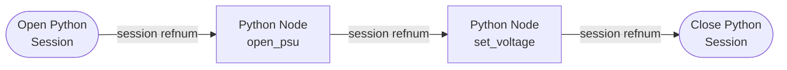
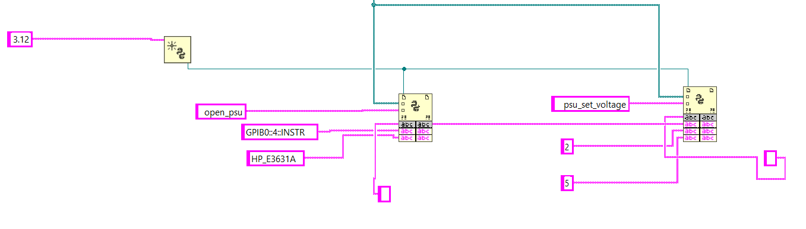
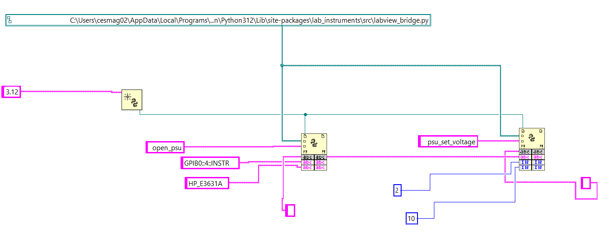
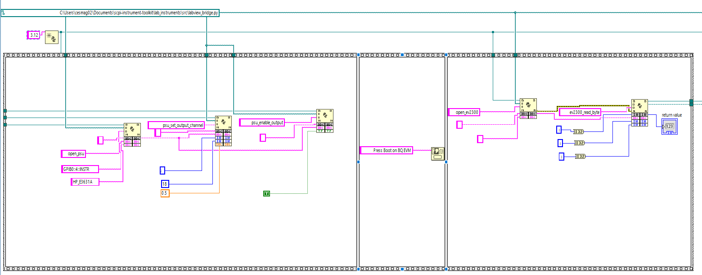
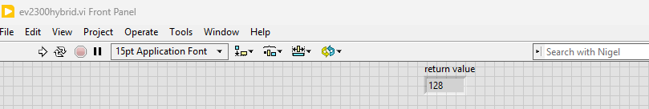

# LabVIEW Bridge

Call the toolkit's Python instrument drivers from LabVIEW using the built-in **Python Node** (LabVIEW 2018+).

---

## Prerequisites

| Requirement | Notes |
|---|---|
| **LabVIEW 2018+** | Python Node was introduced in LabVIEW 2018 |
| **Python 3.10+** | Must match LabVIEW bitness (64-bit LabVIEW needs 64-bit Python) |
| **scpi-instrument-toolkit** | `pip install git+https://github.com/T-O-M-Tool-Oauto-Mationator/scpi-instrument-toolkit.git` |
| **NI-VISA** | For USB/GPIB/LAN instruments |

!!! warning "Python must be on your PATH"
    When installing Python, check the box **"Add Python to PATH"**. LabVIEW uses the system PATH to find the Python interpreter. If Python is not on PATH, the Python Node will fail silently.

!!! warning "Bitness must match"
    64-bit LabVIEW requires 64-bit Python. 32-bit LabVIEW requires 32-bit Python. A mismatch will cause the Python Node to fail with no useful error message.

---

## Step 1: Find the Bridge Module Path

There are two ways to get the path, depending on how you installed the toolkit.

### Option A: pip install (installed from PyPI or git)

Open a terminal and run:

```bash
python -c "from lab_instruments.src import labview_bridge; print(labview_bridge.__file__)"
```

Copy the full path. Example:

```text
C:\Users\you\AppData\Local\Programs\Python\Python312\Lib\site-packages\lab_instruments\src\labview_bridge.py
```

### Option B: git clone (repo on disk)

Use the top-level shim at the repository root instead:

```text
C:\path\to\scpi-instrument-toolkit\labview_bridge.py
```

This file re-exports every function from the real bridge and is the recommended target for git-clone setups.

!!! note "Either path works"
    Both files expose identical function names. The only difference is the path you paste into the Python Node's module path terminal.

---

## Step 2: Understand the Python Node Pattern

LabVIEW's Python integration uses a **"railroad track" pattern** with three palette items found under **Connectivity > Python** in the Functions palette:



The **session refnum** wire passes through every Python Node like a railroad track — that's how they all share the bridge's instrument cache.

### The Three Palette Items

1. **Open Python Session** — Creates a Python interpreter session
    - Input: Python version number — use your installed Python's **major.minor** (e.g. `3.12` for Python 3.12.x). Older LabVIEW versions accept the bare `3`; LabVIEW 2024+ generally requires the explicit minor. Check what's installed with `python --version` and feed that to the constant.
    - Output: A **session refnum** (reference wire) — thread this through all your Python Nodes

2. **Python Node** — Calls one Python function
    - Has built-in terminals for: **session refnum**, **module path** (Path type), and **function name** (String)
    - **Resize the node** (drag the bottom edge down) to add input terminals for the function's parameters
    - Parameters are **positional** — the order you wire them must match the Python function signature
    - Has **one output terminal** on the right — right-click it to set the expected return type
    - Has **error in/out** terminals along the bottom

3. **Close Python Session** — Shuts down the Python interpreter
    - Always close the session when your VI is done

!!! tip "Session persistence is critical"
    The bridge stores instrument connections in a Python module-level cache. All Python Nodes that share the same session refnum share the same cache. This means `open_psu()` in one node and `psu_set_voltage()` in the next node can find each other's data — **as long as they share the same session wire**.

---

## Step 3: Tutorial — Set PSU to 5V and Read DMM

This tutorial uses instruments from the ESET-453 lab bench:

- **HP E3631A** PSU — typically on `GPIB0::1::INSTR` but **the actual address varies by bench**
- **HP 34401A** DMM — typically on `GPIB0::22::INSTR`

!!! warning "Discover your bench's actual GPIB addresses before wiring constants"
    GPIB primary addresses are set per-instrument on each bench and may not match the values above. Before you build the VI, find the real addresses with the toolkit's discovery helper:

    ```powershell
    python -c "from lab_instruments.src import labview_bridge; print(labview_bridge.list_visa_resources())"
    ```

    You should see something like:

    ```text
    ["GPIB0::4::INSTR", "GPIB0::22::INSTR", ...]
    ```

    Then pair each address with its instrument by querying the IDN string (NI MAX > Devices and Interfaces > GPIB0 > Scan for Instruments works too). Use **those** addresses in the String Constants in the steps below — if you hardcode `GPIB0::1::INSTR` and your PSU is actually at address 4, `open_psu` will throw `VI_ERROR_NLISTENERS` on the first SCPI write.

### 3.1 Create a New VI

Open LabVIEW and create a new blank VI (**File > New VI**). Switch to the **Block Diagram** window (Ctrl+E).

### 3.2 Place Open Python Session

1. Right-click the block diagram to open the **Functions palette**
2. Navigate to **Connectivity > Python**
3. Place **Open Python Session** on the left side of your diagram
4. Right-click the **version** input terminal and select **Create > Constant**
5. Set the constant value to your installed Python's **major.minor** version (e.g. `3.12` for Python 3.12.x).
    - Run `python --version` in a terminal to confirm what's installed.
    - LabVIEW 2024+ generally requires the explicit minor (`3.12`, `3.11`). Older LabVIEW versions accept the bare `3`. If `3.12` errors out on your install, fall back to `3`.

### 3.3 Place the First Python Node — Open the PSU

1. From the same **Connectivity > Python** palette, place a **Python Node** to the right of Open Python Session
2. Wire the **session refnum** output from Open Python Session into the Python Node's session input (top-left terminal)
3. Wire the **module path** terminal:
    - Right-click it and select **Create > Constant**
    - This creates a **Path** constant — paste your module path from Step 1
4. Wire the **function name** terminal:
    - Right-click it and select **Create > Constant**
    - Type: `open_psu`
5. **Add function parameters** — drag the bottom edge of the Python Node down to expose **2 additional input terminals**

    !!! tip "Parameter terminals: drop constants from the palette"
        Right-click > Create > Constant works on the built-in **module path** and **function name** terminals, but is **unreliable on the expanded parameter terminals** you expose by dragging the node down. Those terminals are Variant until a wire is attached, so the menu often refuses to create a constant of the correct type.

        Workaround used in the steps below: place a constant of the correct type from the Functions palette (**Programming > String > String Constant**, **Programming > Numeric > Numeric Constant**, or **Programming > Boolean > True/False Constant**), type the value into it, then wire it into the parameter terminal.

    !!! warning "Parameter order is top-to-bottom — the wire's destination terminal is what counts"
        LabVIEW maps the expanded parameter slots onto your Python function's positional arguments **top-to-bottom**. For `open_psu(visa_address, driver_name)`:

        - **Topmost** expanded slot → `visa_address` (1st positional arg)
        - **Next slot down** → `driver_name` (2nd positional arg)

        What matters is **which terminal on the Python Node the wire lands on**, not where you placed the String Constant on the diagram. If you swap them, `open_psu` will throw `VI_ERROR_RSRC_NFOUND` (PyVISA tries to open `"HP_E3631A"` as a resource and fails to parse it) or `ValueError: Unknown driver` (depending on which way they're swapped).

        Also: **no leading or trailing whitespace** in your String Constants. `" GPIB0::4::INSTR"` (with a leading space) is not the same string as `"GPIB0::4::INSTR"` and will fail validation with a confusing error.

6. Wire the first parameter (the **topmost** expanded slot — this becomes `visa_address`):
    - From the Functions palette, place a **String Constant** (**Programming > String**) on the diagram
    - Type your PSU's actual address (e.g. `GPIB0::1::INSTR` or `GPIB0::4::INSTR` — see the warning at the top of Step 3)
    - Wire it into the **top** expanded parameter terminal on the Python Node
7. Wire the second parameter (the **next slot down** — this becomes `driver_name`):
    - Place another **String Constant** from **Programming > String**
    - Type: `HP_E3631A`
    - Wire it into the **second-from-top** expanded parameter terminal
8. **Set the output type** — right-click the output terminal on the right side, select the return type as **String**
    - At runtime, this output **wire** will carry the instrument ID string (e.g. `"psu_1"`). The output itself isn't stored anywhere — the value only exists on the wire while the VI runs.
    - **What to do with the output:** you have two choices, and you'll typically do both:
        - **Wire it forward** into the next Python Node's `instrument_id` input. That's how `psu_set_voltage` in Step 3.4 receives the ID. The wire *is* the variable — no String Constant in between.
        - **Optional debug indicator:** right-click the output terminal and select **Create > Indicator** to put a String Indicator on the front panel that displays the ID after each run. Useful while learning. You can delete it once the chain is working.

    !!! warning "A String Constant cannot receive an output"
        If you placed an empty String Constant near the output terminal expecting it to "fill in" with `"psu_1"`, delete it — String Constants only feed values **into** nodes, they don't capture outputs. Use an **Indicator** (or just wire the output directly into the next node).

### 3.4 Place Python Node — Set Voltage to 5V on Channel 2

1. Place another **Python Node** to the right
2. Wire the **session refnum** through from the previous node
3. Wire the same **module path** (you can branch the wire or create another constant)
4. Set **function name** to: `psu_set_voltage`

    !!! tip "First-time chains: prefer `psu_set_output_channel` over `psu_set_voltage`"
        `psu_set_voltage(id, channel, voltage)` only programs the voltage setpoint — it does not touch the channel's current limit. If you have not previously set the current limit on this channel, the PSU may have it at 0 A (or whatever the previous user left it at), and `psu_enable_output(True)` will land in CC mode at 0 A with no deliverable power.

        For a fresh chain, use `psu_set_output_channel(id, channel, voltage, current_limit)` instead — it sends `APPLY ch, V, I` which sets both setpoints in one call and matches what `psu set` does in the REPL. Use 0.1-0.5 A for a typical low-current load like the BQ76920 EVM.

        As of v1.0.63, `open_psu`'s safe-state init sets the current limit to the channel's `DEFAULT_CURRENT_LIMIT` (1.0 A on +6V, 0.5 A on each ±25V) instead of zero, so a stand-alone `psu_set_voltage` call is now safe on freshly-opened PSUs. The tip still applies if your chain reuses a session that may have explicitly zeroed the limit.

5. Drag the bottom edge down to expose **3 input terminals**

    !!! warning "Read the constant's COLOR to confirm its type"
        LabVIEW color-codes constants by data type. Picking the wrong type is the most common source of confusing Python Node errors.

        | Color | Type | Use for |
        |---|---|---|
        | Pink / magenta | **String** | `instrument_id`, VISA addresses, driver names, function names |
        | Blue | **I32** (integer) | `channel`, register addresses, byte values |
        | Orange | **DBL** (double-precision float) | `voltage`, `current`, frequencies, measurements |
        | Green | **Boolean** | enable/disable flags |

        If you place a constant via **Programming > String > String Constant**, you get a **pink** constant — even if you type a number into it, Python receives the string `"2"`, not the integer `2`. The bridge's `psu_set_voltage` validator will then raise `ValueError: HP_E3631A channel must be 1, 2, or 3. Got '2' (type: str).` — note the **quotes around `'2'`** and the `(type: str)` tag, which is your diagnostic tell that you placed a String Constant by mistake.

        For numeric inputs, place a **Numeric Constant** via **Programming > Numeric > Numeric Constant**. To force I32 specifically, right-click the constant and select **Representation > I32**.

6. Wire the inputs in order. The constants go in expanded slots top-to-bottom (see the slot-order warning in Step 3.3 step 5):
    - **instrument_id** (String) — wire from the output of the `open_psu` node (top slot)
    - **channel** (I32) — place a **Numeric Constant** from **Programming > Numeric**, right-click and set **Representation > I32**, type `2` (the +25V channel) — the constant should appear **blue**
    - **voltage** (DBL) — place another **Numeric Constant**, leave at the default DBL representation, type `5.0` — the constant should appear **orange**
7. Set output type to **String** (returns `"OK"`)

!!! failure "Anti-example — pink String Constants where Numeric Constants belong"
    The diagram below produces the confusing-looking error `HP_E3631A channel must be 1, 2, or 3. Got '2' (type: str).` even though `2` is clearly in the allowed set. The reason is that `2` and `5` are **String Constants** (pink), so Python receives them as `"2"` and `"5"` — strings, not integers.

    

    The fix is to delete the two pink constants, place **Numeric Constants** from **Programming > Numeric** instead (blue for I32, orange for DBL), type the same numbers, and wire them into the same slots. The next admonition shows the result.

!!! example "Reference layout — verified working open_psu + psu_set_voltage chain"
    Block diagram showing the correct wiring for opening the HP E3631A PSU on `GPIB0::4::INSTR` and setting the +25V channel to 10V. Notice the **blue** I32 constants on the `channel` and `voltage` inputs (this VI uses 10V; the tutorial uses 5V — same shape).

    

    What to look at:

    - Pink String Constants for the VISA address (`GPIB0::4::INSTR`) and driver name (`HP_E3631A`) flowing into `open_psu`'s top two parameter slots.
    - The session refnum (teal wire) threading across **both** Python Nodes.
    - The `open_psu` output wire branching down to a String Indicator (the small grey box under the node — optional, for debugging) AND continuing right into `psu_set_voltage`'s top parameter slot (`instrument_id`).
    - Blue I32 Numeric Constants `2` and `10` (channel and voltage) wired into the lower two parameter slots of `psu_set_voltage`.

### 3.5 Place Python Node — Enable PSU Output

1. Place another Python Node
2. Wire session refnum and module path
3. Set function name to: `psu_enable_output`
4. Expand to **2 input terminals**:
    - **instrument_id** (String) — wire from the `open_psu` output
    - **enabled** (Boolean) — place a **True Constant** from **Programming > Boolean** and wire it in (or use a False Constant to disable)
5. Set output type to String

### 3.6 Place Python Node — Open the DMM

1. Place another Python Node
2. Wire session refnum and module path
3. Set function name to: `open_dmm`
4. Expand to **2 input terminals** — for each, place a **String Constant** from **Programming > String**, type the value, and wire it in:
    - `GPIB0::22::INSTR`
    - `HP_34401A`
5. Set output type to **String** (returns DMM instrument ID like `"dmm_2"`)

### 3.7 Place Python Node — Measure DC Voltage

1. Place another Python Node
2. Wire session refnum and module path
3. Set function name to: `dmm_measure_dc_voltage`
4. Expand to **1 input terminal**:
    - **instrument_id** (String) — wire from the `open_dmm` output
5. Set output type to **Double** (returns the measured voltage)
6. Right-click the output terminal and select **Create > Indicator** — this puts a numeric indicator on the front panel to display the reading

### 3.8 Clean Up — Close Instruments and Session

1. Place a Python Node for `close_instrument` with the PSU's instrument_id
2. Place another Python Node for `close_instrument` with the DMM's instrument_id
3. Place **Close Python Session** (from the Connectivity > Python palette) at the end
4. Wire the session refnum through to Close Python Session

### 3.9 Wire Error Clusters

Every Python Node has **error in** (bottom-left) and **error out** (bottom-right) terminals. Wire them in series through all your nodes:

```text
Open Session → Node 1 → Node 2 → ... → Close Session
  error out ──> error in ──> error in ──> error in
```

This ensures that if any node fails (e.g. instrument not found), subsequent nodes are skipped and you get the error message.

### 3.10 Run the VI

1. Switch to the **Front Panel** (Ctrl+E)
2. Click **Run** (the arrow button) or press Ctrl+R
3. The numeric indicator should show the voltage reading from your DMM

### Complete Block Diagram Layout


The **session refnum** (teal wire in LabVIEW) threads through every node from `Open Python Session` to `Close Python Session`. The **error cluster** wires in parallel along the bottom of every Python Node so that a failure in any node short-circuits the rest and surfaces the message at the end of the chain.

---

## Step 4: Tutorial — EV2300 I2C Register Read

This example opens the EV2300 and reads the SYS_STAT register (0x00) from a BQ76920 at I2C address 0x08.

!!! warning "BQ76920 hardware prerequisites"
    The BQ76920 cannot respond to I2C until two conditions are met:

    1. **The EVM is powered** at 9-21V on BATT+/-. If the EVM shares your PSU, run a `psu_set_voltage` + `psu_enable_output(True)` chain (Step 3 above) first and confirm the PSU's Output LED is lit.
    2. **The BOOT button on the EVM has been pressed** since the last power-on. The BQ defaults to SHIP mode and only a hardware BOOT pulse wakes it.

    If either condition is missing, `ev2300_read_byte` fails with `RuntimeError: Device error (0x46)`. See Troubleshooting for the full recovery flow.

### Block Diagram

1. **Open Python Session** (version = your installed Python's major.minor, e.g. `3.12`)
2. **Python Node** — `open_ev2300`
    - 1 input: `""` (empty string = auto-detect)
    - Output type: String (returns `"ev2300_1"`)
3. **One Button Dialog** (Programming > Dialog & User Interface) — message: `Press BOOT on BQ EVM, then click OK`. Blocks the VI so the human can press the BOOT button before the read fires. Alternative: use `ev2300_wait_for_bq` instead (next step) and press BOOT during the poll window.
4. **Python Node** — `ev2300_wait_for_bq` *(recommended)*
    - 2 inputs: instrument_id (String), `30.0` (DBL = timeout seconds)
    - Output type: String (returns `"OK"` once the BQ ACKs; raises `TimeoutError` if it doesn't)
    - Polls CC_CFG every 0.5 s, so it returns the moment you press BOOT. Removes the manual-timing race.
5. **Python Node** — `ev2300_read_byte`
    - 3 inputs: instrument_id (String), `8` (I32 = I2C address 0x08), `0` (I32 = register 0x00)
    - Output type: **I32** (returns the register value, e.g. `0`)
    - Create an Indicator on the output to display the value
6. **Python Node** — `close_instrument`
7. **Close Python Session**

!!! tip "Coordinated PSU + EV2300 workflow"
    When the same VI both powers the BQ EVM (via PSU) and reads from it (via EV2300), order matters. Use a **Flat Sequence Structure** (Programming > Structures > Flat Sequence Structure) with three frames:

    - **Frame 1**: PSU chain — `open_psu` → `psu_set_output_channel(id, 2, 18.0, 0.5)` → `psu_enable_output(id, True)`. After this frame the PSU's Output LED is lit and 18V is on the EVM with a 0.5 A current limit. Use `psu_set_output_channel` (not `psu_set_voltage`) to set both voltage AND current limit in one call — see the tip in Step 3.4.
    - **Frame 2**: `One Button Dialog` saying "Press Boot on BQ EVM" — blocks until the human presses BOOT and clicks OK. *Or* `ev2300_wait_for_bq` in Frame 3 with a generous timeout.
    - **Frame 3**: EV2300 chain — `open_ev2300` → (optional `ev2300_wait_for_bq`) → `ev2300_read_byte` → close nodes.

    Frames execute strictly left-to-right, eliminating the race where `ev2300_read_byte` could fire before `psu_enable_output` finished.

!!! example "Working reference VI: `examples/labview/ev2300_hybrid.vi`"
    A complete, verified version of this chain ships in the repo at [`examples/labview/ev2300_hybrid.vi`](https://github.com/T-O-M-Tool-Oauto-Mationator/scpi-instrument-toolkit/blob/main/examples/labview/ev2300_hybrid.vi). Open it in LabVIEW to see the exact wiring. The screenshots below are taken from this VI running on the ESET-453 bench.

    **Block diagram** (note the Flat Sequence with 3 frames, the orange `0.5` DBL constant feeding `psu_set_output_channel`'s current_limit slot, the green `T` Boolean for `psu_enable_output`, and the I32 indicator on `ev2300_read_byte`'s output):

    

    **Front panel** (the I32 indicator displays `128` = `0x80` = the BQ76920's CC_READY flag, which is the typical idle SYS_STAT value):

    

    To decode the byte: SYS_STAT bit 7 (`0x80`) is **CC_READY** — a Coulomb Counter conversion just completed. Other typical bits: `0x40` = DEVICE_XREADY (internal fault), `0x20` = OVRD_ALERT, `0x10`/`0x08`/`0x04`/`0x02`/`0x01` = various protection flags. See BQ76920 datasheet [SLUSBK2I](https://www.ti.com/lit/ds/symlink/bq76920.pdf) Section 8.5.1 for the full bitmap.

---

## Data Type Mapping

| Python Type | LabVIEW Type | Example |
|---|---|---|
| `str` | String | Instrument IDs, JSON results, `"OK"` |
| `int` | I32 | Channel numbers, register addresses, byte values |
| `float` | Double | Voltages, currents, measurements |
| `bool` | Boolean | Enable/disable flags |

Complex data (instrument lists, device info) is returned as **JSON strings**. Parse them in LabVIEW using the Flatten/Unflatten from JSON functions or a string parser.

---

## Function Reference

The tables below list every bridge function with its **positional argument order**. This order is what determines how to wire your Python Node — the top expanded parameter slot is argument #1, the next slot down is argument #2, and so on. LabVIEW does **not** look at Python parameter names; only position matters.

### How to look up a function's signature on your own

You will encounter functions in your own labs that are not in this exact tutorial. Three reliable ways to confirm argument order without guessing:

1. **This page** — every function is documented below with its full Python-style signature: `function_name(arg1: type, arg2: type, ...) -> return_type`. Wire the arguments into Python Node parameter slots in the same order they appear in the parentheses.

2. **Built-in Python help** — from any terminal where the toolkit is installed:

    ```powershell
    python -c "from lab_instruments.src import labview_bridge; help(labview_bridge.psu_set_voltage)"
    ```

    Replace `psu_set_voltage` with whichever function you care about. You get the canonical signature plus the docstring including parameter descriptions and return type. This is the most authoritative source because it reads directly from the source file LabVIEW is actually calling.

3. **The source file itself** — open `labview_bridge.py` at the path printed by Step 1. Search for `def psu_set_voltage` (or whatever function) to see the exact signature. This is also useful when an error message references a line number — you can jump straight to the validation that fired.

!!! tip "Why argument order matters more than names in LabVIEW"
    Python is forgiving about keyword arguments (`psu_set_voltage(channel=2, voltage=5.0, instrument_id="psu_1")` works in plain Python). The LabVIEW Python Node is **not** — it only passes positional arguments in the order you wire them. Wire `voltage` into the slot where `channel` is expected and the call will silently do the wrong thing (`set_voltage(channel=5.0)` would then fail validation, but with a more confusing error than you would expect).

### Discovery

| Function | Signature | Returns |
|---|---|---|
| `discover_instruments` | `() -> str` | JSON: `{"psu": "HP_E3631A", ...}` |
| `list_available_drivers` | `() -> str` | JSON list of driver name strings |
| `list_open_instruments` | `() -> str` | JSON: `{"psu_1": "HP_E3631A", ...}` |
| `list_visa_resources` | `() -> str` | JSON list of VISA resource strings |

### Connection

| Function | Signature | Returns |
|---|---|---|
| `open_instrument` | `(visa_address: str, driver_name: str) -> str` | instrument ID |
| `open_psu` | `(visa_address: str, driver_name: str) -> str` | instrument ID (validates PSU) |
| `open_dmm` | `(visa_address: str, driver_name: str) -> str` | instrument ID (validates DMM) |
| `open_awg` | `(visa_address: str, driver_name: str) -> str` | instrument ID (validates AWG) |
| `open_scope` | `(visa_address: str, driver_name: str) -> str` | instrument ID (validates Scope) |
| `open_smu` | `(visa_address: str, driver_name: str) -> str` | instrument ID (validates SMU) |
| `open_ev2300` | `(resource_name: str) -> str` | instrument ID (pass `""` to auto-detect) |
| `close_instrument` | `(instrument_id: str) -> str` | `"OK"` |
| `close_all` | `() -> str` | `"OK"` |

### Power Supply (PSU)

| Function | Signature | Returns |
|---|---|---|
| `psu_set_voltage` | `(id: str, channel: int, voltage: float) -> str` | `"OK"` |
| `psu_set_current_limit` | `(id: str, channel: int, current: float) -> str` | `"OK"` |
| `psu_set_output_channel` | `(id: str, channel: int, voltage: float, current_limit: float) -> str` | `"OK"` |
| `psu_enable_output` | `(id: str, enabled: bool) -> str` | `"OK"` |
| `psu_measure_voltage` | `(id: str, channel: int) -> float` | Measured volts |
| `psu_measure_current` | `(id: str, channel: int) -> float` | Measured amps |
| `psu_disable_all` | `(id: str) -> str` | `"OK"` |

### Digital Multimeter (DMM)

| Function | Signature | Returns |
|---|---|---|
| `dmm_measure_dc_voltage` | `(id: str) -> float` | Volts DC |
| `dmm_measure_ac_voltage` | `(id: str) -> float` | Volts AC |
| `dmm_measure_dc_current` | `(id: str) -> float` | Amps DC |
| `dmm_measure_resistance_2w` | `(id: str) -> float` | Ohms (2-wire) |
| `dmm_measure_resistance_4w` | `(id: str) -> float` | Ohms (4-wire) |
| `dmm_measure_frequency` | `(id: str) -> float` | Hz |
| `dmm_measure_diode` | `(id: str) -> float` | Volts (forward) |

### Function Generator (AWG)

| Function | Signature | Returns |
|---|---|---|
| `awg_set_waveform` | `(id: str, channel: int, wave_type: str, frequency: float, amplitude: float, offset: float) -> str` | `"OK"` |
| `awg_set_frequency` | `(id: str, channel: int, frequency: float) -> str` | `"OK"` |
| `awg_set_amplitude` | `(id: str, channel: int, amplitude: float) -> str` | `"OK"` |
| `awg_set_dc_output` | `(id: str, channel: int, voltage: float) -> str` | `"OK"` |
| `awg_enable_output` | `(id: str, channel: int, enabled: bool) -> str` | `"OK"` |
| `awg_disable_all` | `(id: str) -> str` | `"OK"` |

### Oscilloscope

| Function | Signature | Returns |
|---|---|---|
| `scope_run` | `(id: str) -> str` | `"OK"` |
| `scope_stop` | `(id: str) -> str` | `"OK"` |
| `scope_single` | `(id: str) -> str` | `"OK"` |
| `scope_set_vertical_scale` | `(id: str, channel: int, volts_per_div: float) -> str` | `"OK"` |
| `scope_set_timebase` | `(id: str, time_per_div: float) -> str` | `"OK"` |
| `scope_measure_vpp` | `(id: str, channel: int) -> float` | Volts peak-to-peak |
| `scope_measure_frequency` | `(id: str, channel: int) -> float` | Hz |
| `scope_measure_vrms` | `(id: str, channel: int) -> float` | Volts RMS |

### EV2300 (I2C Bridge)

| Function | Signature | Returns |
|---|---|---|
| `ev2300_wait_for_bq` | `(id: str, timeout_s: float = 30.0) -> str` | `"OK"` once BQ ACKs; raises `TimeoutError` |
| `ev2300_read_byte` | `(id: str, i2c_addr: int, register: int) -> int` | Byte value (0-255) |
| `ev2300_write_byte` | `(id: str, i2c_addr: int, register: int, value: int) -> str` | `"OK"` |
| `ev2300_read_word` | `(id: str, i2c_addr: int, register: int) -> int` | 16-bit value |
| `ev2300_write_word` | `(id: str, i2c_addr: int, register: int, value: int) -> str` | `"OK"` |
| `ev2300_read_block` | `(id: str, i2c_addr: int, register: int) -> str` | JSON list of ints |
| `ev2300_write_block` | `(id: str, i2c_addr: int, register: int, data_json: str) -> str` | `"OK"` |
| `ev2300_get_device_info` | `(id: str) -> str` | JSON device info |

Call `ev2300_wait_for_bq` between `open_ev2300` and the first `ev2300_read_*` call when the BQ EVM is being powered up alongside the VI. The function polls CC_CFG until the BQ ACKs, so it returns the moment you press the BOOT button (no manual timing race).

### SMU (Source Measure Unit)

| Function | Signature | Returns |
|---|---|---|
| `smu_set_voltage_mode` | `(id: str, voltage: float, current_limit: float) -> str` | `"OK"` |
| `smu_set_current_mode` | `(id: str, current: float, voltage_limit: float) -> str` | `"OK"` |
| `smu_enable_output` | `(id: str, enabled: bool) -> str` | `"OK"` |
| `smu_measure_voltage` | `(id: str) -> float` | Volts |
| `smu_measure_current` | `(id: str) -> float` | Amps |

### Generic / Utility

| Function | Signature | Returns |
|---|---|---|
| `send_scpi` | `(id: str, command: str) -> str` | `"OK"` |
| `query_scpi` | `(id: str, command: str) -> str` | Response string |
| `reset_instrument` | `(id: str) -> str` | `"OK"` |
| `get_instrument_type` | `(id: str) -> str` | `"psu"`, `"dmm"`, `"awg"`, `"scope"`, `"smu"`, `"ev2300"` |
| `get_version` | `() -> str` | Package version string |

---

## PSU Channel Mapping

The bridge normalizes channel numbers (1, 2, 3) across all PSU drivers:

| Channel | HP E3631A | EDU36311A | MPS-6010H | PXIe-4139 |
|---|---|---|---|---|
| 1 | +6V (P6V) | +6V (P6V) | *(single channel)* | *(single channel)* |
| 2 | +25V (P25V) | +30V (P30V) | --- | --- |
| 3 | -25V (N25V) | -30V (N30V) | --- | --- |

Single-channel PSUs (MPS-6010H, PXIe-4139) ignore the channel argument.

---

## Supported Drivers

| Driver Name | Instrument | Type |
|---|---|---|
| `HP_E3631A` | HP E3631A Triple Output PSU | PSU |
| `EDU36311A` | Keysight EDU36311A Triple Output PSU | PSU |
| `MPS6010H` | MATRIX MPS-6010H-1C (60V/10A) | PSU |
| `HP_34401A` | HP/Agilent 34401A DMM | DMM |
| `EDU34450A` | Keysight EDU34450A DMM | DMM |
| `XDM1041` | Owon XDM1041 DMM | DMM |
| `EDU33212A` | Keysight EDU33212A AWG | AWG |
| `BK_4063` | BK Precision 4063 AWG | AWG |
| `JDS6600` | JDS6600/Seesii DDS Generator | AWG |
| `MSO2024` | Tektronix MSO2024 Oscilloscope | Scope |
| `DHO804` | Rigol DHO804 Oscilloscope | Scope |
| `DSOX1204G` | Keysight DSOX1204G Oscilloscope | Scope |
| `PXIe_4139` | NI PXIe-4139 SMU | SMU |
| `EV2300` | TI EV2300 USB-to-I2C Adapter | EV2300 |

---

## Error Handling

Python exceptions automatically become LabVIEW error clusters when you wire the error terminals. Common errors:

| Python Exception | Meaning |
|---|---|
| `KeyError` | Invalid instrument ID (not open or already closed) |
| `TypeError` | Wrong instrument type (e.g. calling `psu_set_voltage` on a DMM) |
| `ValueError` | Invalid parameter (bad channel number, out-of-range voltage) |
| `RuntimeError` | EV2300 I2C communication failure |
| `ConnectionError` | Instrument not connected |

Wire the **error in/out** clusters through all your Python Nodes in series. If any node throws an exception, subsequent nodes are skipped and the error propagates to the end of your chain.

---

## Troubleshooting

**ImportError: attempted relative import with no known parent package**

This error means LabVIEW loaded `labview_bridge.py` as a standalone script instead of as part of the `lab_instruments` package, causing all `from .xyz import` statements to fail.

Fix: make sure the version of the toolkit installed is **1.0.5 or later** (the file was patched to handle standalone loads). Upgrade with:

```powershell
pip install --upgrade git+https://github.com/T-O-M-Tool-Oauto-Mationator/scpi-instrument-toolkit.git
```

If you are using a git clone and cannot upgrade, switch the Python Node's module path to the top-level shim at the repository root (`labview_bridge.py`) instead of the buried path in `lab_instruments/src/`.

---

**Python Node shows "Python not found" or fails silently**

- Verify Python is on your system PATH: open a terminal and type `python --version`
- Verify bitness matches: 64-bit LabVIEW needs 64-bit Python
- Try setting the version input on Open Python Session to your installed Python's **major.minor** (e.g. `3.12`). LabVIEW 2024+ generally rejects the bare `3` and demands an explicit minor; older LabVIEW versions accept either. Run `python --version` to confirm which is installed.

**Error 1672 at Open Python Session / "Hex 0x688 unknown Python error"**

- Open Python Session is failing before any Python code runs. `python312.dll` is never loaded into LabVIEW. Two common causes:
- **A stray Python process is holding the runtime.** A previous `pytest` run, REPL session, or aborted VI can leave a `python.exe` alive that locks the interpreter against new sessions. Kill it: in PowerShell, `Get-Process python | Stop-Process -Force`, then retry.
- **`niPythonInterface.dll` cached a previous failure.** Once Open Python Session fails in a LabVIEW process, the result is cached and every subsequent attempt fails without re-checking. Fix: close the VI, quit LabVIEW entirely, reopen and try again.

**`RuntimeError: Device error (0x46)` from any `ev2300_*` function**

- The EV2300 sent an I2C request but the BQ76920 slave did not ACK. Three common causes:
- **BQ76920 is in SHIP mode.** The BQ defaults to SHIP after every power-on and only a hardware BOOT pulse wakes it. Press the BOOT button on the EVM. In LabVIEW, prefer `ev2300_wait_for_bq` (or a One Button Dialog between `open_ev2300` and `ev2300_read_byte`) so the human has time to press BOOT before the read fires.
- **No power on the BQ EVM.** Confirm the PSU is at 18V on the +25V channel AND the Output LED is lit (programmed voltage alone is not enough — `psu_enable_output(True)` must have fired). If the LED is off, see the next entry.
- **EV2300 firmware in a wedged state from a prior failed transaction.** In the REPL run `ev2300 cycle` to disconnect, prompt for BOOT, and reconnect cleanly. In LabVIEW, `close_instrument` the EV2300, prompt for BOOT, then `open_ev2300` again.

**PSU is in CC mode at 0 A even though voltage was set and output is enabled**

- The PSU programmed voltage is showing 18 V, the Output LED is lit (or you wired `psu_enable_output(True)`), but the PSU display shows **CC** (Constant Current) and the current reads **0 A** under any real load.
- Cause: the channel's current limit is set to 0.0 A. The PSU is correctly current-limiting at 0 A, which collapses the output voltage the instant any load draws current.
- Pre-1.0.63 bug: `open_psu`'s safe-state init zeroed the current limit. As of v1.0.63 this is fixed (defaults preserved). If you are on an older bridge or the limit was explicitly zeroed by another call, work around with `psu_set_output_channel(id, channel, voltage, current_limit)` which sends `APPLY` and sets both setpoints. 0.1-0.5 A is plenty for a low-current load like a BQ76920 EVM.
- Sanity check from the REPL: `psu meas <ch> i` reads measured current. `psu set <ch> <V> <A>` resets both setpoints (this is what the REPL `psu set` does internally — it always passes both values).

**PSU display shows the programmed voltage but Output LED is off**

- The PSU front panel can display a programmed setpoint without the output stage being energized. The LED is the authoritative state.
- **Most common cause: `psu_enable_output` was called with `False`.** Verify the Boolean Constant wired into the second parameter slot reads **T** (green). A pink String Constant, an unwired terminal, or a False Constant all produce this symptom. The bridge now raises `TypeError: psu_enable_output: 'enabled' must be a Boolean...` if anything other than a real `bool` is passed.
- **Sanity check:** with the VI stopped, press the physical Output On/Off button on the E3631A — the LED should toggle. If it does, the PSU is fine and the VI is the problem; if not, there's a PSU fault (look for OVP/OCP/error on the display).

**`VI_ERROR_NLISTENERS (-1073807265)` / "No listeners condition is detected"**

- The VISA resource opened, but no device on the bus acknowledged the first SCPI write (`*CLS` during `open_psu`)
- Almost always means the **GPIB primary address is wrong for your bench** — the doc's `GPIB0::1::INSTR` is a typical value, not a universal one
- Discover the real address: `python -c "from lab_instruments.src import labview_bridge; print(labview_bridge.list_visa_resources())"` (or use NI MAX > Scan for Instruments)
- Once you know the address, update the String Constant feeding `open_psu` / `open_dmm` to match
- Also verify: instrument is powered on, GPIB cable is seated, and you're not on a second controller (`GPIB1` vs `GPIB0`)

**`ValueError: Unknown driver '<something>'.`**

- The driver name being passed to `open_psu` / `open_dmm` does not match any entry in the bridge's `_DRIVER_MAP`
- **Check for leading or trailing whitespace** in the String Constant feeding the `driver_name` parameter. `" HP_E3631A"` (leading space) is not the same string as `"HP_E3631A"` and will fail the allowlist check. Double-click into the constant and confirm there are no stray spaces before or after the text
- **Check the parameter slot order**: the topmost expanded parameter slot is `visa_address`, the next slot down is `driver_name`. If your wires are swapped, `GPIB0::4::INSTR` ends up as `driver_name` and you get `Unknown driver ' GPIB0::4::INSTR'` (the error message even prints the leading space inside the quotes — that's your tell)
- Confirm the driver string matches the **Supported Drivers** table exactly (case-sensitive): `HP_E3631A`, `EDU36311A`, `HP_34401A`, etc.

**Instrument not found / KeyError on second node**

- Make sure all Python Nodes share the **same session refnum wire** from Open Python Session
- If each node opens its own session, the module cache is separate and `psu_set_voltage` can't find the instrument opened by `open_psu`

**"No module named lab_instruments"**

- The toolkit is not installed in the Python that LabVIEW is using
- Run `pip install git+https://github.com/T-O-M-Tool-Oauto-Mationator/scpi-instrument-toolkit.git` in the same Python installation

**Raw SCPI escape hatch**

If the bridge doesn't have a wrapper for your specific command, use `send_scpi()` / `query_scpi()` to send any SCPI command directly to the instrument.

---

## Tips & Gotchas

Specific quirks of the LabVIEW Python Node + this toolkit that trip students up most often.

- **Use a venv, not the global Python.** A virtual environment isolates the toolkit and its dependencies from anything else on the machine. It also makes the integration reproducible on the next workstation: same `python.exe`, same `pip freeze`. See [NI TestStand Setup](teststand.md) for one way to create a TAMU-friendly venv on the `H:` drive that LabVIEW can point at.
- **Pick "Open Venv Python Session" from the dropdown.** The default palette item is **Open Anaconda Python Session**. Right-click it and change to **Open Venv Python Session** (LabVIEW 2024+) -- otherwise the wire types do not match a plain pip venv and you will get a vague session error.
- **Set the return type with a wire, not just the right-click menu.** Drag a data-type wire (String, Double, I32, Boolean) onto the small grey return-type box on the right of the Python Node. Without this, the node returns a Variant that LabVIEW will not auto-coerce.
- **Expand the node by dragging the bottom edge.** Each drag-down step exposes one more positional input. The order of inputs must match the Python signature -- LabVIEW does not look at parameter names.
- **Always wire `session refnum` through every node.** All Python Nodes that share the same session also share the bridge's module-level instrument cache. If you accidentally start a second session, `open_psu` in session A is invisible to `psu_set_voltage` in session B and you will get a `KeyError`.
- **Read the function source.** When in doubt about argument order or types, open `labview_bridge.py` (path printed by Step 1) and look at the signature -- LabVIEW will not tell you what it expects.
- **64-bit LabVIEW needs 64-bit Python.** A bitness mismatch fails silently. If "Open Python Session" returns no error but later nodes throw `Python not found`, this is the cause.

---

## Student case study: ADC parametric testing (Lab 8)

Maxim Benanti and Caden Citron (ESET 453, Spring 2026) used this LabVIEW bridge for Lab 8 ADC parametric testing -- driving the EV2300 + BQ76920 from a LabVIEW VI that called `open_ev2300`, `ev2300_read_word`, and `close_instrument` through a `.venv` Python Session.

Their 6-slide writeup -- including a screenshot of the actual block diagram, the venv setup steps, and a measured Expected-vs-Measured voltage sweep -- is bundled with the docs:

[Download: Labview/Python Hybridization (PDF, 257 kB)](assets/labview-python-hybridization-benanti-citron.pdf)

Use it as a reference layout when wiring up your own VI.
