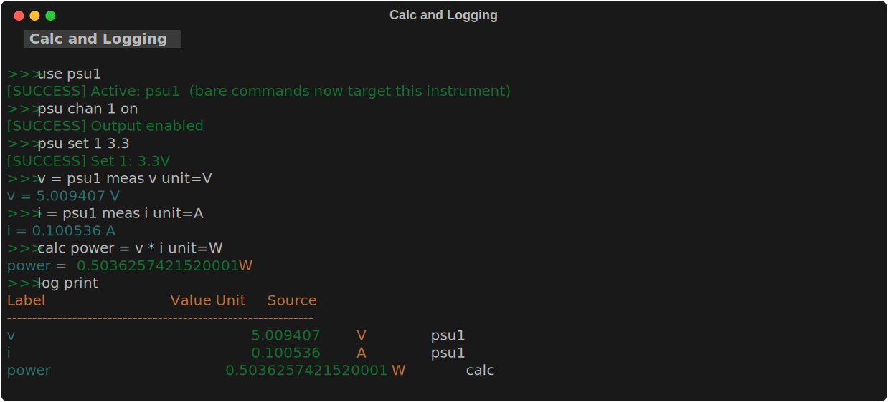

# Log & Calc

---

## The measurement log -- what it is and why you need it



Every time you use the assignment syntax (`label = instrument meas ...`), the REPL saves the result to a persistent **measurement log** — a table that accumulates all your readings for the current session.

```text
┌─────────────────────────────────────────────────────────┐
│  output_v = psu meas v unit=V                           │
│       │               │                                 │
│       │               └─ what to measure (voltage)      │
│       │                                                 │
│       └─ label: the name you choose                     │
│           for this row in the table                     │
└─────────────────────────────────────────────────────────┘
```

After recording a few measurements, the log looks like:

```text
Label       Value       Unit   Source
output_v    4.9987      V      psu.meas
dmm_v       4.9992      V      dmm.read
freq_ch1    999.87      Hz     scope.meas.FREQUENCY
```

`log print` shows it. `log save results.csv` exports it. `calc` does math on the values.

---

## What is a label?

A **label** is the name you give a stored measurement — the row key in the table above.

**Rules:**

- No spaces — use underscores: `output_v`, `ch1_pk2pk`, `r_load`
- Must be unique per session — storing twice with the same label **overwrites** the earlier value
- You reference it in `calc` by bare name (e.g. `output_v`)

**Why labels matter:** without a name, you can't retrieve the value later. `psu meas v` just prints to the screen and is gone. `output_v = psu meas v` saves it so you can compute `calc error output_v - 5.0` afterwards.

```text
# meas = print only (nothing saved):
psu meas v          # prints 4.9987, then forgotten

# assignment syntax = save with a name:
output_v = psu meas v unit=V    # saves 4.9987 as "output_v"
calc error output_v - 5.0           # retrieves it: 4.9987 - 5.0 = -0.0013
log print                            # shows the full table
```

---

## log print

Display all recorded measurements in the terminal.

```text
log print
```

Prints a formatted table with columns: **Label | Value | Unit | Source**.

Run this at the end of a test sequence to review all results.

---

## log save

Export the measurement log to a file.

```text
log save <filename> [csv|txt]
```

| Parameter | Required | Values | Description |
|-----------|----------|--------|-------------|
| `filename` | required | file path | Output file path. |
| `csv\|txt` | optional | `csv`, `txt` | Format. Defaults to `csv` if the filename ends in `.csv`, otherwise `txt`. |

```text
log save results.csv              # CSV format (opens in Excel)
log save results.txt              # formatted text table
log save ../results/data.csv      # relative path from script dir
```

!!! note "Path resolution"
    Relative paths are resolved from the **script directory** when running inside a script, or the **data directory** when used interactively. Use absolute paths to override.

CSV files can be opened directly in Excel, LibreOffice Calc, or imported into Python with pandas.

---

## log clear

Remove all measurements from the log.

```text
log clear
```

Use this before starting a new test sequence to ensure only the new results are saved.

```text
log clear
script run my_test
log print
log save my_test_results.csv
```

---

## calc

Compute a derived value and add it to the log. There are two equivalent forms:

```text
# Preferred — plain assignment with optional unit=
<label> = <expression> [unit=<str>]

# Alternative — explicit calc keyword
calc <label> = <expression> [unit=<str>]
```

| Parameter | Required | Values | Description |
|-----------|----------|--------|-------------|
| `label` | required | string, no spaces | Name for the computed result. Stored in both the measurement log and as a script variable. |
| `expression` | required | Python arithmetic | Math expression using bare variable/label names. |
| `unit=` | optional | string | Unit label shown in `log print`. Display-only. |

Both forms are functionally identical. The plain assignment form is preferred because it reads naturally:

### Accessing stored measurements

Reference any previously stored value by its bare label name:

```text
psu_v = psu1 meas v unit=V
psu_i = psu1 meas i unit=A
calc power psu_v * psu_i unit=W
```

Script variables assigned with `=` are also available by name:

```text
offset = 0.05
calc corrected psu_v - offset unit=V
```

Use `last` to reference the most recently stored value:

```text
dmm1 config vdc
my_reading = dmm1 meas unit=V
calc doubled last * 2 unit=V
```

### Available functions and constants

| Name | Description |
|------|-------------|
| `<label>` | Bare label name — accesses any script variable or stored measurement |
| `last` | The most recently stored value |
| `abs(x)` | Absolute value |
| `min(a, b)` | Minimum of two values |
| `max(a, b)` | Maximum of two values |
| `round(x, n)` | Round to n decimal places |
| `pi` | π (3.14159...) |
| `e` | Euler's number (2.71828...) |
| `sqrt(x)` | Square root |
| `log(x)` | Natural logarithm |
| `log2(x)` | Base-2 logarithm |
| `log10(x)` | Base-10 logarithm |
| `exp(x)` | e^x |
| `floor(x)` | Floor |
| `ceil(x)` | Ceiling |
| `sin(x)` / `cos(x)` / `tan(x)` | Trigonometry (radians) |
| `is_nan(x)` / `is_inf(x)` / `is_finite(x)` | NaN/infinity checks |
| `int(x)` / `float(x)` / `str(x)` | Type conversions |
| `hex(x)` / `bin(x)` / `oct(x)` | Base conversions |

### Chained calculations

The result of `calc` is stored in both the log and script variables, so you can chain calculations:

```text
v_in = psu1 meas v unit=V
i_in = psu1 meas i unit=A
dmm1 config vdc
v_out = dmm1 meas unit=V

calc power_in  v_in * i_in unit=W
calc power_out v_out * i_in unit=W      # assume same current
calc efficiency power_out / power_in * 100 unit=%
```

### Examples

**Compute percentage error:**

```text
dmm1 config vdc
measured = dmm1 meas unit=V
calc error_pct (measured - 5.0) / 5.0 * 100 unit=%
```

**Voltage ratio (gain):**

```text
v_in = scope1 meas 1 PK2PK unit=V
v_out = scope1 meas 2 PK2PK unit=V
calc gain v_out / v_in
calc gain_db 20 * log10(gain) unit=dB
```

**Resistance from V and I:**

```text
v_supply = psu1 meas v unit=V
dmm1 config idc
i_load = dmm1 meas unit=A
calc resistance v_supply / i_load unit=Ω
```

**Crest factor:**

```text
pk2pk = scope1 meas 1 PK2PK unit=V
rms = scope1 meas 1 RMS unit=V
calc crest_factor pk2pk / (2 * rms)
```

---

## check

Assert that a stored measurement falls within acceptable limits. Appends a pass/fail result to the test report.

```bash
check <label> <min> <max>
check <label> <expected> tol=<N>
check <label> <expected> tol=<N>%
```

| Parameter | Required | Description |
|-----------|----------|-------------|
| `label` | required | Label of a stored measurement (must exist in the log). |
| `min` / `max` | required (range form) | Inclusive lower and upper bounds. |
| `expected` + `tol=` | required (tolerance form) | Center value and absolute tolerance. |
| `tol=<N>%` | optional | Percentage tolerance: pass if `\|value − expected\| ≤ N/100 × expected`. |

Prints `[PASS]` or `[FAIL]` with the measured value and limits. A failed check sets an error flag — scripts with `set -e` will stop on failure.

```bash
dmm1 config vdc
vout = dmm1 meas unit=V

check vout 4.75 5.25          # pass if 4.75 V ≤ vout ≤ 5.25 V
check vout 5.0 tol=0.25       # pass if |vout − 5.0| ≤ 0.25 V
check vout 5.0 tol=5%         # pass if within 5% of 5.0 V
```

Results are collected in memory and shown with `report print` or exported with `report save`.

---

## report

View or export a lab test report containing all `check` pass/fail results.

```bash
report print
report save <path>
report clear
report title <text>
report operator <name>
```

| Subcommand | Description |
|------------|-------------|
| `print` | Print the check results table to the terminal |
| `save <path>` | Generate a PDF report at the given path |
| `clear` | Clear test results and the screenshot list |
| `title <text>` | Set the report title shown in the PDF header |
| `operator <name>` | Set the operator name shown in the report header |

```bash
report title "PSU Accuracy Test"
report operator "J. Smith"

# ... run checks ...

report print              # view results in terminal
report save results.pdf   # export PDF
```

!!! note
    `report save` requires `fpdf2`: `pip install fpdf2`

---

## data dir — controlling where files are saved

By default, screenshots, waveform CSVs, and `log save` files all land in `~/Documents/scpi-instrument-toolkit/data/`. Use `data dir` to point them anywhere you want for the current session.

```text
data dir <path>    # set output directory (absolute or relative to cwd)
data dir           # print the current output directory
data dir reset     # go back to the default
```

| Example | Effect |
|---------|--------|
| `data dir .` | Save files in the current working directory |
| `data dir ./lab3` | Save files in a `lab3/` subfolder of cwd |
| `data dir /mnt/usb/captures` | Save to an absolute path |
| `data dir C:/Users/lab/output` | Windows path with forward slashes |
| `data dir reset` | Restore default (`~/Documents/scpi-instrument-toolkit/data/`) |

!!! tip "Windows paths"
    Forward slashes work on all platforms. Backslashes and spaces in paths are also supported without quoting:
    ```text
    data dir C:\Users\lab\output
    data dir C:/My Documents/lab
    ```

The setting applies to every save command in the session — `scope screenshot`, `scope save`, and `log save` all respect it. Subdirectories within the output dir are still created automatically (e.g. `scope screenshot lab3/cap.png` → `<data_dir>/lab3/cap.png`).

You can also use it inside a `.scpi` script so the output location is part of the test setup:

```text
# lab3.scpi
data dir .     # save everything relative to where I launched the REPL

log clear
for VIN {SWEEP}
  ...
  scope screenshot cap_{VIN}V.png
  scope save 1,2,3,4 wave_{VIN}V.csv
end
log save results.csv
```

!!! note
    `data dir` only affects the current REPL session. For a permanent default, set the `SCPI_DATA_DIR` environment variable before launching the REPL — it takes effect whenever `data dir` has not been set.

---

## Typical workflow

```text
# 1. Clear previous results
log clear

# 2. Run measurements
psu1 chan 1 on
psu1 set 5.0
sleep 0.5

psu_v = psu1 meas v unit=V     # save as "psu_v"
psu_i = psu1 meas i unit=A     # save as "psu_i"
dmm1 config vdc
dmm_v = dmm1 meas unit=V       # save as "dmm_v"

# 3. Derive values
calc power       psu_v * psu_i unit=W
calc v_error     dmm_v - psu_v unit=V
calc v_error_pct v_error / psu_v * 100 unit=%

# 4. Review and export
log print
log save results.csv
```
