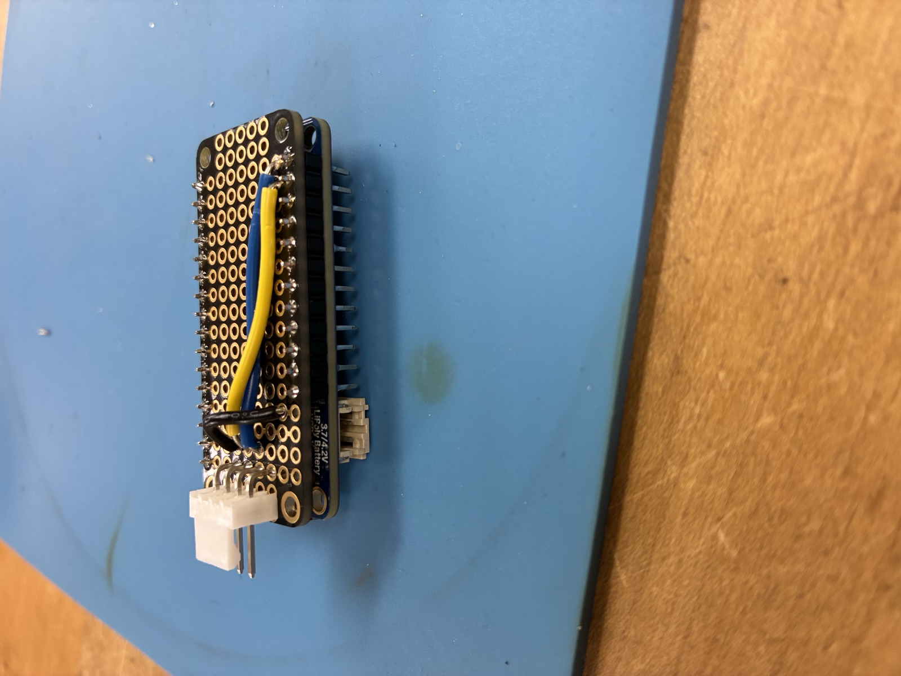

# Chapter 1: Getting Started

## What is the SCPI Instrument Toolkit?

The SCPI Instrument Toolkit is a Python-based command-line tool for controlling lab instruments -- oscilloscopes, power supplies, multimeters, function generators, source measure units, and USB-to-I2C adapters -- directly from your terminal. Instead of clicking through vendor GUIs or writing full Python programs, you type short commands and get instant results.

The toolkit was built for ESET 453 (Validation and Verification) at Texas A&M University. It supports the instruments in the VOAL lab and works on both personal and managed TAMU machines.

## What You Need

Before installing, make sure you have:

- **Python 3.10 or newer** -- Check by running `python --version` in your terminal.
- **NI-VISA runtime** -- Required for USB and GPIB communication with instruments. Download from https://www.ni.com/en/support/downloads/drivers/download.ni-visa.html

## Installation

### Standard install (any machine)

Open a terminal (PowerShell on Windows, Terminal on Mac/Linux) and run:

    pip install git+https://github.com/T-O-M-Tool-Oauto-Mationator/scpi-instrument-toolkit.git

### TAMU managed machines (VOAL lab)

On TAMU-managed Windows machines where admin access is restricted, use the installer script `setup-tamu.ps1` from this repo. It handles PATH issues and installs the toolkit into your user Python directory.

**Recommended (safer): download, review, then run**

    irm "https://raw.githubusercontent.com/T-O-M-Tool-Oauto-Mationator/scpi-instrument-toolkit/main/setup-tamu.ps1" -OutFile setup-tamu.ps1
    notepad setup-tamu.ps1                 # skim the contents, look for anything unexpected
    powershell -ExecutionPolicy Bypass -File .\setup-tamu.ps1

Downloading to a file first lets you (or a TA) inspect exactly what will run before executing it. This is the right habit to form for any "install-from-internet" script.

**Shortcut (only if you trust the source):**

    irm "https://raw.githubusercontent.com/T-O-M-Tool-Oauto-Mationator/scpi-instrument-toolkit/main/setup-tamu.ps1" | iex

`irm | iex` runs the fetched script directly in your shell without saving it, so you cannot review what you are about to execute. Use this form only when you have seen the script before or a TA tells you to.

### Verify installation

After installing, verify it works:

    scpi-repl --version

You should see something like `scpi-instrument-toolkit v1.0.17`.

If `scpi-repl` is not recognized, use the module form instead:

    python -m lab_instruments --version

## Launching the REPL

There are three ways to start the REPL:

**With real instruments:**

    scpi-repl

This auto-discovers any instruments connected to your machine via USB, GPIB, or serial.

**Without hardware (mock mode):**

    scpi-repl --mock

This simulates 14 instruments so you can practice commands without being in the lab.

**Module form (if scpi-repl is not on your PATH):**

    python -m lab_instruments
    python -m lab_instruments --mock

## What You See on First Launch

When you start the REPL, it automatically scans for connected instruments:

    $ scpi-repl --mock
    ESET Instrument REPL v1.0.17. Type 'help' for commands.
    [INFO] Scanning for instruments in background...
    [SUCCESS] Scan complete: found 14 device(s).
    eset>

The `eset>` prompt means the REPL is ready for commands.

## Mock Mode: Practice Without Hardware

Mock mode simulates all the instruments you would find in the VOAL lab. This is useful for:

- Practicing commands before going to the lab
- Writing and testing scripts at home
- Learning the toolkit without hardware access

The 14 simulated devices are:

| Name    | Type              | Simulates               |
|---------|-------------------|-------------------------|
| psu1    | Power Supply      | HP E3631A               |
| psu2    | Power Supply      | Matrix MPS-6010H        |
| psu3    | Power Supply      | Keysight EDU36311A      |
| smu     | Source Measure Unit | NI PXIe-4139           |
| awg1    | Function Generator | Keysight EDU33212A     |
| awg2    | Function Generator | JDS6600                |
| awg3    | Function Generator | BK Precision 4063     |
| dmm1    | Multimeter        | HP 34401A               |
| dmm2    | Multimeter        | OWON XDM1041            |
| dmm3    | Multimeter        | Keysight EDU34450A      |
| scope1  | Oscilloscope      | Rigol DHO804            |
| scope2  | Oscilloscope      | Tektronix MSO2024       |
| scope3  | Oscilloscope      | Keysight DSOX1204G      |
| ev2300  | USB-to-I2C Adapter | TI EV2300              |

Mock instruments return realistic random values (not constants), so your measurements will look like real data with small variations.

## Accessibility

If you use a screen reader or prefer plain text output without colors, use the `--no-color` flag:

    scpi-repl --no-color
    scpi-repl --mock --no-color

You can also set the `NO_COLOR` environment variable to disable colors globally.

## Connecting the STM32 Adapter (VOAL Lab Only)

The VOAL lab uses a small USB-to-I2C adapter to talk to the BQ76920 battery monitor board. TAMU-owned benches use a TI EV2300A; newer benches use an in-house STM32F405 replacement that plugs in the same way. Your REPL sees both as `ev2300` and the commands are identical - you do not need to know which bridge is on your bench.

Plug-in order matters. Do this every time:

1. Set the bench PSU to 18 V and turn it on so the BQ EVM has power.
2. Plug the USB cable from the STM32 adapter (or EV2300) into your computer.
3. Press the **BOOT** button on the BQ EVM. This clears any stuck state on the I2C bus from the last student.
4. Launch `scpi-repl` and type `scan`. You should see `ev2300` in the device list.

If `scan` does not find the adapter or reads return garbage, see Chapter 11 (Troubleshooting) - the fix is almost always "repeat the plug-in order above" or unplug-replug the USB cable.

You will never need to solder or disassemble the adapter. If a unit is physically broken, hand it to a TA - Chapter 12 of the TA Developer Guide covers the rebuild.

## Try It

Open a terminal and run:

    scpi-repl --mock

Type `list` to see all connected mock instruments, then type `help` to see available commands. You are ready to start measuring.
