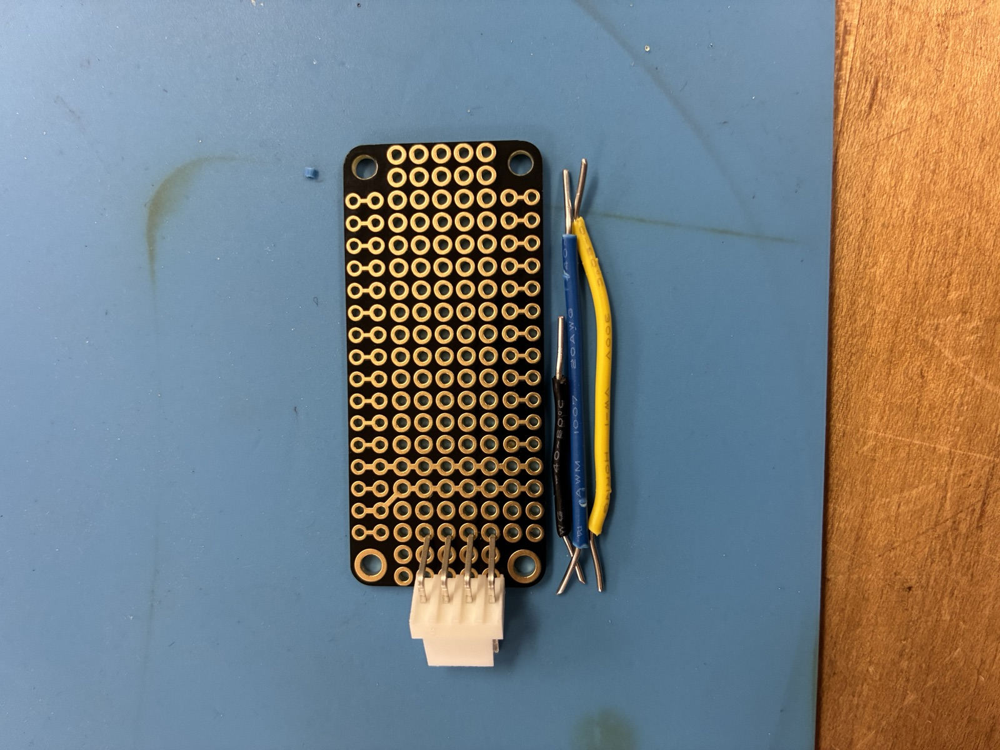
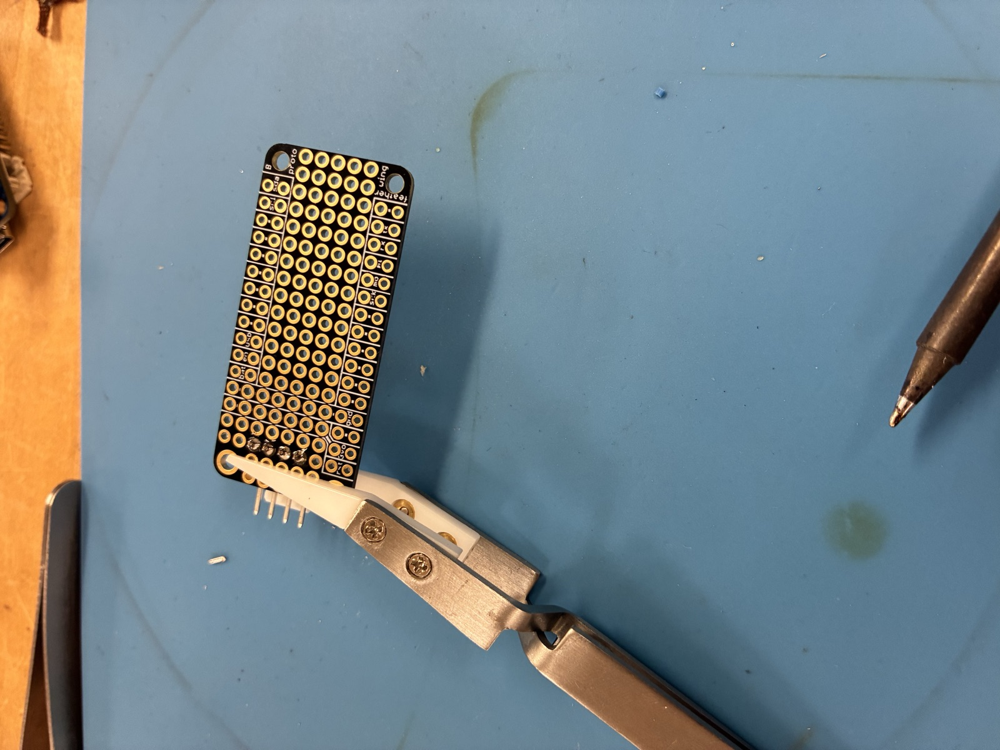
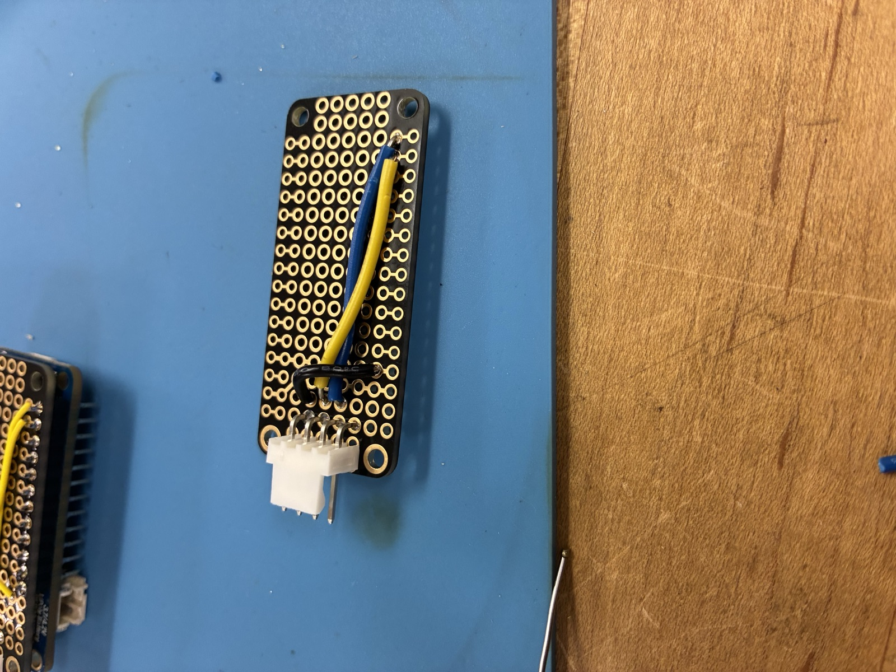
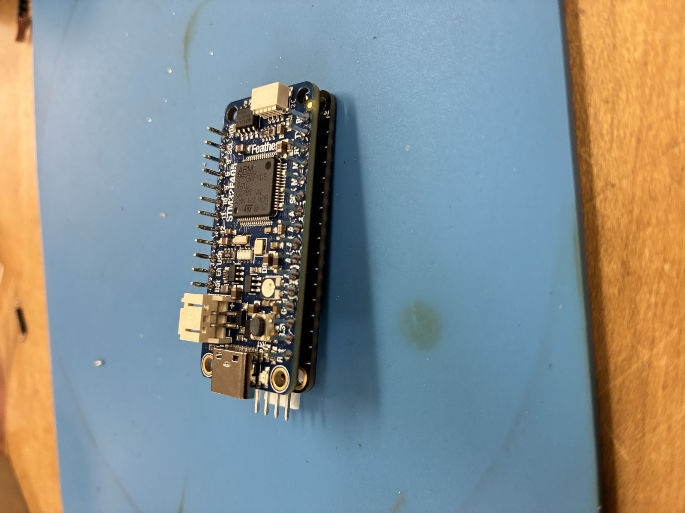

# Chapter 12: The STM32 Bridge (EV2300 Replacement)

## Why we built it

The TI EV2300A USB-to-SMBus bridge is the original "TAMU bench standard" adapter students use to talk to the BQ76920 battery-monitor IC on its EVM board. It is discontinued, and replacement units on the secondary market are expensive and inconsistent. To keep ESET 453 lab kits running past the current supply, we built a drop-in replacement out of an Adafruit Feather STM32F405 + a FeatherWing protoboard.

Key properties of the replacement:

- Open hardware, ~$25 in parts per unit, solderable in ~30 minutes.
- Enumerates over USB HID with the same semantics the EV2300 driver already speaks.
- `lab_instruments/src/ev2300.py` autodetects both bridges; no REPL or script changes are required.
- Firmware is re-flashable via the STM32 DFU bootloader, so any TA can service a unit without vendor tools.

## Bill of Materials (per unit)

| Part | Qty | Notes |
|------|-----|-------|
| Adafruit Feather STM32F405 Express | 1 | USB-C, SPI/I2C pins broken out on the Feather edge |
| Adafruit FeatherWing Proto PCB | 1 | Socketed pin grid that mates to the Feather |
| JST-PH 4-pin right-angle connector | 1 | Mates the ribbon cable that ships with the BQ EVM I2C header |
| Male pin header strips, 0.1 in | 2 | Cut to length for the Feather edges |
| 22 AWG solid hookup wire (yellow, blue, black) | ~6 in each | SDA, SCL, GND |
| Heat-shrink, 3 mm diameter | ~50 mm (~2 in) | Strain relief where the JST pigtail meets the board |
| USB-C cable | 1 | Reuse from bench kit |

Cost is ~$25 per kit at current Adafruit pricing.

## Soldering the adapter

The build goes in five stages. Take continuity measurements between stages 3 and 5; catching a short before you stack the Feather saves a lot of time.

### Step 1 - Bare protoboard and connector

- Position the JST connector on the short edge of the protoboard, keyway facing out so the cable can seat without fighting the Feather body above it.
- Pre-cut two lengths of 22 AWG hookup wire for SDA (yellow) and SCL (blue). GND and 3V3 use the two outer JST shell pins and short traces on the protoboard.

### Step 2 - Mount in the helping-hand

- Clamp the protoboard close to the JST connector but not on it; the connector body warps if squeezed.
- Tack one JST pin first, check that the connector sits flush, then solder the remaining three.

### Step 3 - Back-side wiring to the JST

> **WARNING - do NOT connect the red wire on the BQ EVM ribbon.**
> The red wire is a NO-CONNECT. **Do not route it to 3V3** - the BQ EVM provides its own logic rail and back-powering the bridge through that pin will fight the Feather regulator, and can destroy either board. Clip and heat-shrink the red conductor before you start wiring.

- SDA pad on the Feather footprint routes to JST pin 2 (yellow).
- SCL pad routes to JST pin 3 (blue).
- GND pad routes to JST pin 4.
- The red wire on the BQ EVM ribbon is a no-connect - see the warning above.
- Before stacking, buzz each pad-to-pin trace with a DMM in continuity mode. Any two adjacent pins should read OL.

### Step 4 - Headers on the Feather

- Push male headers through the Feather from the top side, long end down.
- Use the protoboard itself as a jig: drop the Feather onto it so the headers land straight, then solder the four corner pins before doing the rest. This keeps the two boards coplanar.

### Step 5 - Stack and finish

- Separate the boards, tin the Feather headers, then re-seat and solder each header pin through to the protoboard pads.
- Add a 3 mm heat-shrink collar where the JST cable exits the board for strain relief.
- Plug the JST cable into the BQ EVM I2C header and a USB-C cable into the Feather.

## Firmware

Flash the Feather with the STM32 bridge firmware before handing the unit out.

- **Firmware source:** [`github.com/CesMag/BQ76920_Bridge`](https://github.com/CesMag/BQ76920_Bridge) (public). Build artifacts (`BQ76920_Bridge.bin` / `.elf`) are produced by the repo's CI on every PR and uploaded as workflow artifacts.
- **Flash path:** USB DFU into the STM32F405 ROM bootloader. Move the `B0` jumper on the Feather to `3V3`, press `RESET`, then either run `dfu-util -a 0 --dfuse-address 0x08000000:leave -D BQ76920_Bridge.bin` or use the Adafruit WebDFU page. Move `B0` back to `GND` and press `RESET` to boot the new firmware.

### USB VID/PID: lab-only reuse

During lab deployment the STM32 firmware currently enumerates with the same USB descriptor as the retired TI EV2300A (VID `0x0451`, PID `0x0036`). That lets `lab_instruments/src/ev2300.py` pick the bridge up with zero driver changes.

This reuse is acceptable **only** on closed lab benches and unit-under-test kits that never touch a commercial product:

- `0x0451` belongs to Texas Instruments; reusing it on hardware we distribute outside the course would violate the USB-IF rules on VID/PID reuse. Do not ship this firmware on anything that leaves the VOAL lab until one of the following is done:
    - Obtain explicit written authorization from TI for the continued use of their VID/PID on this replacement, **or**
    - Rebuild the firmware with a project-owned VID/PID (Adafruit's test-bench range or a pid.codes sublicense are both reasonable options), and update the driver's match table in `lab_instruments/src/ev2300.py` to add the new descriptor alongside the existing TI one.

Record whichever decision was made in this chapter and in `docs/ev2300.md` before any external release.

If the bridge comes up in DFU mode (no I2C traffic, `scan` shows a "bootloader" descriptor), reflash. There is no recovery path from the REPL.

## Bench verification checklist

After assembly, run this top-to-bottom before labeling the unit as good:

1. Power the BQ76920 EVM from an 18 V bench supply on the external power input.
2. Plug the STM32 bridge USB into the host computer.
3. Press the BOOT button on the BQ EVM. This clears any stuck I2C state from the last session.
4. Launch the REPL: `scpi-repl --no-color`.
5. Run `scan`. Expect `ev2300` in the device list within two seconds.
6. Run `ev2300 read_byte 0x08 0x0B` (CC_CFG). The BQ76920 datasheet requires this register to be set to `0x19` at startup, and the STM32 firmware writes it as part of `BQ76920_Initialise`. A successful read returning `0x19` confirms both that the bridge is talking to the BQ over I2C and that the AFE has completed its init sequence. `0xFF` means no ACK on the bus; `0x00` usually means the chip is in SHIP mode -- press the EVM `BOOT` button and retry.
7. Run `ev2300 scan 0x08` and confirm you get more than 20 readable registers (the BQ76920 occupies 0x00 through 0x59 and most are readable when the AFE is alive).
8. Run the regression subset: `python -m pytest tests/test_ev2300_driver.py -x`.

If any step fails, move to the troubleshooting section below before handing out the kit.

## Troubleshooting the bridge

### Bridge enumerates but `read_word` returns 0xFFFF

The STM32 firmware retries BQ76920 init every 2 s after a failed startup detection. Usually caused by the EVM being unpowered when the USB was plugged in. Fix: leave USB connected, power the EVM, then call `ev2300 read_word ...` again. The `wait_for_bq` helper in `lab_instruments/src/ev2300.py` polls `CC_CFG` (reg `0x0B`) on both possible I2C addresses until the IC responds, and is the programmatic version of this procedure.

### Intermittent `0x46` errors on long sessions

Usually USB noise coupling onto the I2C lines. Fixes, in order of cost:

1. Clip a ferrite onto the JST pigtail close to the adapter.
2. Shorten the JST cable run.
3. Replace the USB cable with a shielded one.

### `connect failed` on `scan`

Another process holds the HID handle. Close BQ Studio, then retry.

### Board is dead after flashing

The DFU flow leaves the Feather in app mode only after a clean reset. Try the quick recovery first; if it fails, fall through to the full bootloader re-flash.

**Quick recovery (no extra tools):**

1. Unplug USB.
2. Press and hold **BOOT**.
3. Plug USB back in while still holding BOOT.
4. Release BOOT once the host enumerates the device (1 - 2 s).
5. Re-run `dfu-util` / WebDFU with the STM32 bridge firmware binary.

**Full recovery (STM32CubeProgrammer + ST-LINK):**

Use this when the board does not enumerate at all after the quick recovery:

1. Connect an ST-LINK V2 (or V3) to the Feather's SWD pads (SWCLK, SWDIO, GND, 3V3) - the pads are on the bottom silkscreen.
2. Open STM32CubeProgrammer, select **ST-LINK** as the interface, and click **Connect**.
3. **Full Chip Erase**.
4. Flash the Adafruit STM32F405 bootloader DFU image (`tinyuf2-feather_stm32f405_express_*.bin` from the Adafruit release page) to `0x08000000`.
5. Disconnect ST-LINK, power-cycle the Feather, confirm the Adafruit bootloader enumerates (a USB drive named `FTHRBOOT` should appear).
6. Drop the STM32 bridge firmware UF2 onto that drive to flash the application image.

If STM32CubeProgrammer still cannot connect, the STM32F405 silicon is likely damaged - retire the unit.

## Making another one

This chapter is the build log. BOM, soldering photos, firmware path, and verification checklist are all here - a TA with a soldering iron and a copy of the firmware binary should be able to assemble a replacement unit without any other documentation.
